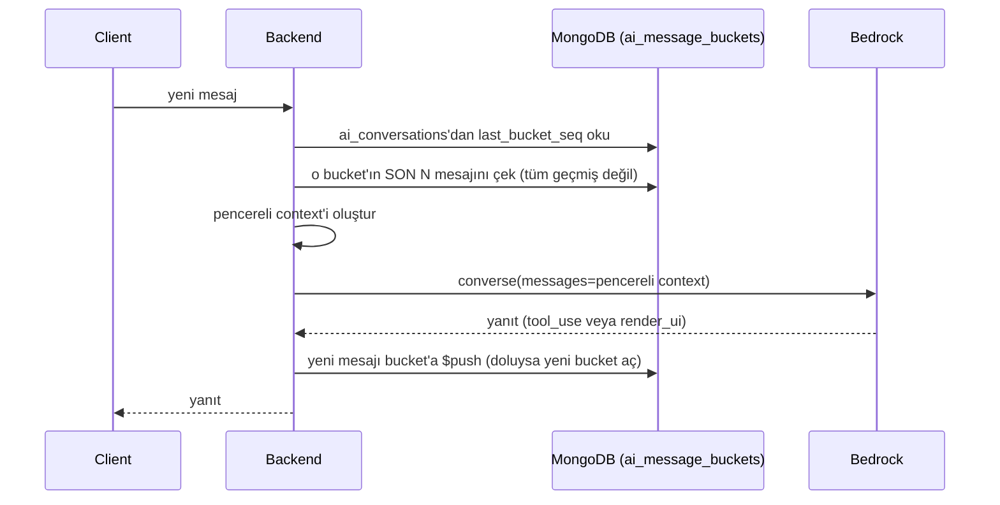

# Konuşma Bağlamı ve Token Bütçesi

Bir AI konuşması teorik olarak sınırsız mesaj içerebilir. Her yeni mesajda **tüm geçmişi** LLM'e göndermek iki soruna yol açar: (1) token maliyeti mesaj sayısıyla orantısız büyür, (2) modelin context penceresi bir noktada dolar. Bu sayfa backend'in bunu nasıl sınırladığını anlatır — mesaj geçmişinin nasıl saklandığı bu sayfanın konusu değil, bkz. [ai_message_buckets](https://yusufkrnz.github.io/databaseschema/mongodb/ai-message-buckets).

## Akış

## Pencereleme kuralı

- Bedrock'a gönderilen context, **son N mesaj** ile sınırlıdır (N, model'in context penceresine ve maliyet bütçesine göre ayarlanan bir sabittir — [core/settings.py](/guides/coding-standards)'a `conversation_window_size` olarak eklenir)
- `N`'den eski mesajlar context'e hiç girmez — kullanıcı çok eski bir mesaja atıfta bulunursa, model bunu "hatırlamaz". Bu kasıtlı bir trade-off: sınırsız hafıza yerine öngörülebilir maliyet
- Bucket Pattern zaten mesajları ≤50'lik gruplar hâlinde tuttuğu için (bkz. [ai_message_buckets](https://yusufkrnz.github.io/databaseschema/mongodb/ai-message-buckets)) "son N mesajı çek" sorgusu çoğunlukla **tek bucket'ı okumakla** çözülür — ekstra agregasyon gerekmez

## Neden özet (summarization) MVP'de yok

Eski context'i bir LLM çağrısıyla özetleyip context'e eklemek (rolling summary) daha "akıllı" bir hafıza sağlar ama kendisi de ekstra bir LLM çağrısı, dolayısıyla ekstra maliyet ve gecikme demektir. MVP'de basit pencereleme yeterli; kullanım verisi (`llm_call_log`'daki gerçek maliyet/gecikme rakamları) özetlemenin gerekliliğini gösterirse eklenir.

## Maliyet takibi

Her Bedrock çağrısının token/maliyet detayı bu akıştan bağımsız olarak [llm_call_log](https://yusufkrnz.github.io/databaseschema/mongodb/llm-call-log)'a yazılır — detay için bkz. [AWS › Bedrock](/aws/bedrock).
