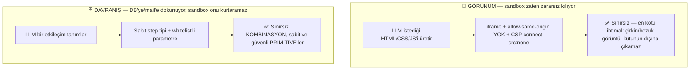
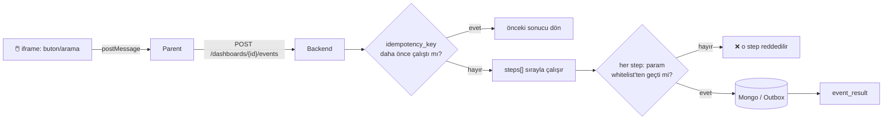

# Dashboard Event Kataloğu ve Dinamik Tablo Kataloğu

## Bu sayfa neden var, ve [Dinamik Sorgu Ölçeklenmesi](/ai/dynamic-function-scaling)'nden farkı ne

Bu klasördeki diğer sayfalar (`ui-tree`, `registry`, `dynamic-function-scaling`) LLM'in **JSON UI ağacı** ürettiği, HTML'e hiç dokunmadığı bir mimariyi anlatıyor. Dashboard özelliği (`services/dashboard_html_service.py`, `dashboard_service.py`) fiilen farklı: kullanıcı doğrudan **LLM'in ürettiği HTML'i** görüyor — `NewPortal-Frontend/src/pages/ai-chat/DashboardHtmlFrame.tsx`'te `<iframe srcDoc={html} sandbox="allow-scripts">` (kasıtlı olarak `allow-same-origin` YOK). Bu iki sayfa çelişmiyor, iki ayrı ihtiyacı karşılıyor:

| | JSON UI Ağacı (`ui-tree`, `registry`) | HTML Dashboard (bu sayfa) |
|---|---|---|
| Kullanım yeri | Sohbet içi render | Kullanıcının "kendi panosu" dediği kalıcı sayfa |
| Şema garantisi | Kapalı component kataloğu | Açık uçlu HTML — güvenliği şema değil, sandbox veriyor |
| Neden bu tercih | — | Kullanıcı gerçekten serbest layout/görsel kompozisyon istiyor — bkz. `.knowledge/decisions/general/2026-08-31_dashboard-interactive-sandbox.md` |

## Kök ilke: sabit primitive + sınırsız kompozisyon

**"Tamamen esnek" olsun istiyoruz — ama esneklik iki farklı yerde yaşıyor, ikisi aynı kurala tabi değil:**



Bu, yeni icat edilen bir kısıtlama değil — **Excel'in, Zapier'in, Airtable'ın, Notion'ın kullandığı aynı model**: kullanıcı "sınırsız" hisseder (kombinasyon uzayı pratikte tükenmez), ama arkada sabit ve küçük (~10-20) bir primitive seti vardır. Gerçek anlamda sınırsız olan tek alternatif — LLM'in ürettiği kodun/SQL'in doğrudan çalıştırılması — kabul edilmedi, çünkü bu esneklik değil, güvenlik sınırının LLM'e devredilmesi demek.

## Katalog 1 — Tablo Kataloğu (tenant'ın kendi tanımladığı şema)

Kullanıcının "özel tablosu" runtime'da LLM tarafından tanımlanıyor (`"ürün adı/fiyat/stok kolonları olsun"`). Postgres migration'ı ile değil, **meta-şema** olarak Mongo'da tutuluyor:

```json
// dashboard_tables (meta-şema)
{
  "_id": "...", "tenant_id": "...", "dashboard_id": "...",
  "name": "urunler",
  "columns": [
    {"name": "urun_adi", "type": "string", "searchable": true},
    {"name": "fiyat", "type": "number", "filterable": true}
  ]
}
```

```json
// dashboard_table_rows (generic veri — tek koleksiyon, tablo başına AYRI koleksiyon açılmıyor)
{
  "_id": "...", "table_id": "...", "tenant_id": "...",
  "data": {"urun_adi": "...", "fiyat": 120},
  "is_deleted": false, "previous": null
}
```

`columns` listesi aynı zamanda **whitelist kaynağı** — her step çağrısında `field`/`patch` anahtarları buna karşı doğrulanır.

## Katalog 2 — Step Pipeline (sabit ~8-10 step tipi, sınırsız dizilim)

Bir buton/arama kutusu tek bir DB işlemi değil, **sıralı bir adım listesi** tetikler — "onayla" butonu hem satır güncelleyebilir, hem mail atabilir, hem audit log yazabilir. Kişiye özel olan hiçbir zaman yeni kod değil, hep **mevcut step tiplerinin dizilimi**:

| Step type | Ne yapar | Whitelist kaynağı |
|---|---|---|
| `list_rows` / `search_rows` | okuma, filtre, arama | `dashboard_tables.columns` |
| `create_row` / `update_row` / `delete_row` | yazma (soft-delete, `previous` saklanır) | `dashboard_tables.columns` |
| `send_email` | mail tetikleme | sabit şablon listesi — mevcut `tenant_outbox_events` altyapısına yazılır, senkron gönderilmez |
| `condition` | "eğer stok 10'un altındaysa devam et" | sabit operatör eşlemesi |
| `compute` | SUM/AVG/IF/COMPARE ile hesaplama | sabit primitive seti |

```python showLineNumbers
class Step(BaseModel):
    type: Literal["list_rows","search_rows","create_row","update_row",
                   "delete_row","send_email","condition","compute"]
    params: dict  # type'a göre HANDLER'ın kendi şemasıyla validate edilir

class DashboardEvent(BaseModel):
    event_id: str
    trigger: dict          # {"type": "button_click", "element_id": "btn-onayla"}
    steps: list[Step]      # kişiye özel olan TEK yer: sıra + parametreler
    stop_on_failure: bool = True

# Her step type kendi whitelist'li şemasını taşıyan bir handler'a bağlanır
STEP_TYPES: dict[str, "StepHandler"] = {
    "update_row": UpdateRowHandler(),   # params_schema: table_id, patch — columns'a karşı doğrular
    "send_email": SendEmailHandler(),   # params_schema: to_field, template (sabit listeden)
    "condition":  ConditionHandler(),   # params_schema: field, op, value
    # ...
}

async def run_event(event: DashboardEvent, tenant_id: UUID, idempotency_key: str) -> None:
    if await already_executed(idempotency_key):     # çift tıklama koruması
        return
    for step in event.steps:
        handler = STEP_TYPES[step.type]                          # bilinmeyen type -> zaten kayıt sırasında reddedildi
        parsed = handler.params_schema.model_validate(step.params) # whitelist burada uygulanıyor
        result = await handler.run(tenant_id, parsed)
        if not result.ok and event.stop_on_failure:
            break                                                  # tamamlanan step'ler GERİ ALINMAZ
    await mark_executed(idempotency_key)
```

LLM hiçbir zaman bu fonksiyonların içine kod yazmıyor — sadece `steps` listesini, sabit `type` alfabesinden seçerek dolduruyor.

### Akış



## İdempotency ve kısmi başarısızlık

Pipeline çok adımlıysa "onayla'ya 2 kere basıldı" ya da "1. adım geçti, 2. adım patladı" gerçek bir risk:

- **Çift çalıştırma** → her tetiklemenin bir `idempotency_key`'i var; aynı key ikinci kez gelirse pipeline hiç çalışmaz, kayıtlı sonuç dönülür.
- **Senkron adımlar idempotent tasarlanır** → `status="onaylandi"` set etmek kaç kere çalışırsa çalışsın aynı sonucu verir.
- **Harici adımlar (mail) outbox'a yazılır** → senkron gönderilmez, mevcut `tenant_outbox_events`/`OutboxPoller`'ın at-least-once + retry mekanizması aynen kullanılır, yeni altyapı gerekmez.
- **Rollback YOK — bilinçli bir sınır** → `stop_on_failure` sadece kalan step'leri durdurur, tamamlanmış step'ler geri alınmaz. Compensating transaction (telafi işlemi) ayrı, ileri seviye bir konu — bugün kapsam dışı.

## Geri alınabilirlik (undo)

`update_row`/`delete_row` step'leri veriyi kalıcı silmiyor: `delete_row` → `is_deleted: true`; `update_row` → eski hâl `previous`'a kopyalanır. Tek seviye undo (event-sourcing değil) — MVP için yeterli.

## Gelecek notu: capability sandboxing (bugün değil)

Step tipi seti bile yetmeyen, gerçekten öngörülemeyen bir mantık gerekirse (döngü, çok adımlı koşullu iş kuralı), bir sonraki adım LLM'e **sandboxlanmış kod** yazdırmak olabilir — V8 isolate/WASM gibi izole bir yorumlayıcıda, dışarıya sadece `db_update`/`send_mail` gibi birkaç fonksiyonun enjekte edildiği bir "dünya" içinde. Bu, **mantığı** sınırsızlaştırır ama **dokunabildiği gerçek işlemleri** yine sabit tutar. Ciddi bir izolasyon altyapısı (timeout, memory limit, prototype pollution koruması) gerektirdiği için bugünün production modeli değil — talep gerçekten birikirse değerlendirilecek bir not.

## Kapsam dışı / açık noktalar

- **Rol bazlı kolon maskeleme** — [EDGE-CASE-032](/ai/dynamic-function-scaling#edge-case-032-kolon-bazlı-hassas-veri-maskeleme-yok) ile aynı boşluk.
- **Step → yetki eşlemesi** — salt-okunur roller henüz ayrılmadı.
- **`dashboard_tables` şemasının kim/ne zaman oluşturduğu** — LLM'in ilk istekte şemayı nasıl önereceği tasarlanmadı.
- **Kod tarafı** — `services/dashboard_event_service.py`, `POST /dashboards/{id}/events` — hiçbiri henüz yazılmadı, bu sayfa tasarım kararı.

## Özet

- Event = tetikleyici + sıralı **step listesi** (JSON, kod değil) — 8-10 sabit step type, sınırsız dizilim/parametre kombinasyonu.
- Kişiye özel olan hep **step'lerin sırası ve parametreleri**, hiçbir zaman yeni kod.
- SQL yok, keyfi kod yok — whitelist'lenmiş alan adı + sabit step tipleriyle kurulan Mongo/outbox çağrıları.
- Çift çalıştırma `idempotency_key` ile, harici yan etkiler outbox ile, rollback yok (bilinçli sınır).
- Sandboxlanmış serbest kod bir gelecek notu — bugünün production modeli değil.
