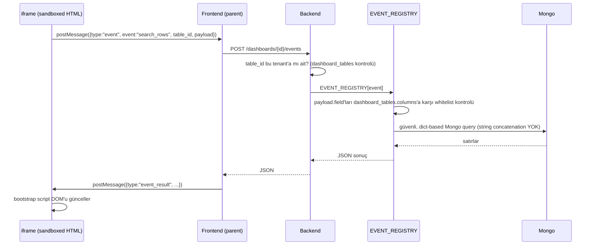

# Dashboard Event Kataloğu ve Dinamik Tablo Kataloğu

## Bu sayfa neden var, ve [Dinamik Sorgu Ölçeklenmesi](/ai/dynamic-function-scaling)'nden farkı ne

Bu klasördeki diğer sayfalar (`ui-tree`, `registry`, `dynamic-function-scaling`) LLM'in **JSON UI ağacı** ürettiği, HTML'e hiç dokunmadığı bir mimariyi anlatıyor — orada varılan karar "HTML basalım" fikrinin **reddi**. Dashboard özelliği (`NewPortal-Backend/services/dashboard_html_service.py`, `dashboard_service.py`) ise fiilen farklı, ayrı bir üretim hattı: kullanıcı doğrudan **LLM'in ürettiği HTML'i** (sandboxed iframe içinde, `dashboard_interactive_enabled` flag'i ile kademeli açılan script izniyle) görüyor. Bu iki sayfa **çelişmiyor**, iki ayrı ihtiyacı karşılıyor:

| | JSON UI Ağacı (`ui-tree`, `registry`) | HTML Dashboard (bu sayfa) |
|---|---|---|
| Kullanım yeri | Sohbet içi render (chat mesajına gömülü kart/grafik) | Ayrı, kalıcı, kullanıcının "kendi panosu" dediği tam sayfa |
| Şema garantisi | Kapalı component kataloğu, whitelist | Açık uçlu HTML — CSP + sandbox ile duvarlanmış, şema garantisi yok |
| Neden bu tercih | — | Kullanıcı gerçekten serbest bir layout/görsel kompozisyon istiyor (şablon+stil seçimi), kapalı bir component kataloğuna sığmıyor — bkz. `.knowledge/decisions/general/2026-08-31_dashboard-interactive-sandbox.md` (NewPortal-Backend reposu) |
| Güvenlik sınırı | Component/alan seviyesinde whitelist | `<meta http-equiv="Content-Security-Policy">` (`connect-src 'none'`, `object-src 'none'` vb.) + `sandbox="allow-scripts"` (asla `allow-same-origin` ile birlikte değil) |

Bu sayfanın konusu: interaktif mod açıldığında (`dashboard_interactive_enabled=true`) üretilen HTML'deki bir buton/arama kutusu/filtre **gerçek veriyi nasıl okuyup yazacak** — CSP zaten `connect-src 'none'` ile ağı kapattığı için, script'in DB'ye ulaşmasının tek yolu `postMessage` ile parent'a haber verip parent'ın onun adına, whitelist'li bir işlemi çalıştırması.

## Sorun: "buton"a SQL bağlamak da, keyfi fonksiyon bağlamamak da yanlış

- **Çıplak SQL** — LLM'in ürettiği HTML'e SQL yazdırmak, tenant izolasyonunu ve injection kontrolünü LLM'in insafına bırakır. Kabul edilemez.
- **Hiçbir şeye bağlamamak** — o zaman "interaktif dashboard" sadece görsel sürükle-bırak kalır, gerçek bir CRUD işlemi yapamaz; ürün ihtiyacı karşılanmaz.
- **Buton başına özel fonksiyon** — kullanıcının isteyeceği tablo/kolon/aksiyon kombinasyonu önceden bilinmiyor ("adamın ne isteyeceğini bilmiyoruz") — [Dinamik Sorgu Ölçeklenmesi](/ai/dynamic-function-scaling)'ndeki `TOOL_REGISTRY` kombinatoryal patlamasının aynısı, burada "buton" seviyesinde tekrarlanıyor.

Çözüm aynı ilkeyi (primitive'i sabitle, kombinasyonu LLM'e/kullanıcıya bırak) iki ayrı katalogla uyguluyor: **event kataloğu** (sabit, ~5 işlem) ve **tablo kataloğu** (tenant'a özel, dinamik şema — ama şemanın kendisi de whitelist kaynağı).

## Katalog 1 — Tablo Kataloğu (tenant'ın kendi tanımladığı şema)

Kullanıcının "özel tablosu" runtime'da LLM tarafından tanımlanıyor (`"ürün adı/fiyat/stok kolonları olsun"`). Bu yüzden Postgres migration'ı ile değil, **meta-şema** olarak tutuluyor — proje zaten hibrit DB kullandığı için (bkz. NewPortal-Backend `databaseschema/docs/mongodb/ai-conversations.md` deseni), bu da Mongo'da:

```json
// dashboard_tables (Mongo, meta-şema)
{
  "_id": "...", "tenant_id": "...", "dashboard_id": "...",
  "name": "urunler",
  "columns": [
    {"name": "urun_adi", "type": "string", "searchable": true},
    {"name": "fiyat", "type": "number", "filterable": true},
    {"name": "stok", "type": "number", "filterable": true}
  ],
  "created_at": "..."
}
```

```json
// dashboard_table_rows (Mongo, generic veri — tek koleksiyon, her tablo için ayrı koleksiyon AÇILMIYOR)
{
  "_id": "...", "table_id": "...", "tenant_id": "...",
  "data": {"urun_adi": "...", "fiyat": 120, "stok": 5},
  "is_deleted": false,
  "previous": null,
  "created_at": "...", "updated_at": "..."
}
```

**Neden tablo başına ayrı Mongo koleksiyonu değil, tek generic koleksiyon + `table_id`:** tenant sayısı × tablo sayısı kadar koleksiyon açmak (a) index/connection yönetimini büyütür (b) `dashboard_tables.columns`'a bakmadan "bu tablo gerçekten var mı, bu tenant'a mı ait" kontrolünü koleksiyon isimlendirmesine yaymış olursun — tek koleksiyon + whitelist kontrolü çok daha az hareketli parça demek.

## Katalog 2 — Event Kataloğu (sabit, ~5 generic operasyon)

Buton/arama kutusu/filtre ayrımı yapılmıyor — hepsi backend için aynı 5 event'ten birine düşüyor:

```python showLineNumbers
EVENT_REGISTRY = {
    "list_rows":   handler(table_id, filters=[], sort=None, page=None),
    "search_rows": handler(table_id, query_text, fields=[]),   # fields whitelist'ten
    "create_row":  handler(table_id, row_data),                # columns'a göre validate
    "update_row":  handler(table_id, row_id, patch),
    "delete_row":  handler(table_id, row_id),                  # soft-delete, previous saklanır
}
```

### Akış



### Injection'ın gerçekte nerede engellendiği

Mongo zaten string concatenation ile sorgu kurulmuyor (`{"data.fiyat": {"$gt": 100}}` gibi dict-based) — asıl risk kullanıcıdan/LLM'den gelen **ham alan adını ya da ham Mongo operatörünü** doğrulamadan sorguya gömmek (`$where`, keyfi `$` operatörü). İki katman:

1. **Alan adı whitelist'i** — `payload`'daki her `field`, o `table_id`'nin `dashboard_tables.columns` listesinde var mı diye kontrol edilir; yoksa 400.
2. **Operatör eşleme tablosu** — kullanıcıdan/LLM'den gelen ham `$` operatörü asla geçirilmez, sabit bir küçük eşleme kullanılır:

```python showLineNumbers
SAFE_OPERATORS = {"eq": "$eq", "gt": "$gt", "lt": "$lt", "contains": "$regex"}
# payload: {"field": "fiyat", "op": "gt", "value": 100}
# çevrilen sorgu: {"data.fiyat": {"$gt": 100}}  -- field VE op ikisi de whitelist'ten geçti
```

Bu, [Dinamik Sorgu Ölçeklenmesi](/ai/dynamic-function-scaling)'ndeki SQL Guard'ın (AST parse + tablo/kolon whitelist + zorunlu `tenant_id` enjeksiyonu) Mongo/NoSQL karşılığı — aynı ilke, farklı sorgu dili.

## Geri alınabilirlik (undo)

`update_row`/`delete_row` veriyi kalıcı silmiyor:

- `delete_row` → `is_deleted: true` set edilir, veri durur.
- `update_row` → yeni `data` yazılmadan önce eski hali `previous` alanına kopyalanır (tek seviye, event-sourcing değil).

Bu, "son işlemi geri al" düzeyinde bir undo'yu, ekstra bir versiyon/audit koleksiyonu açmadan sağlıyor. Tam geçmiş (çoklu undo) gerekirse `dashboard_table_row_history` ayrı koleksiyonuna geçmek bir sonraki adım — MVP'de gerek yok.

## Kapsam dışı / açık noktalar (henüz kod yazılmadı)

- **Rol bazlı kolon maskeleme** — [Dinamik Sorgu Ölçeklenmesi](/ai/dynamic-function-scaling)'ndeki EDGE-CASE-032 ile aynı boşluk burada da var: bir tenant kullanıcısı tabloya erişimi varsa her kolonu görebiliyor, kısmi görünürlük (sadece toplam, tekil değer yok) desteklenmiyor.
- **Event → yetki eşlemesi** — şu an her tenant kullanıcısı kendi tenant'ındaki her `table_id` için her event'i çağırabiliyor; salt-okunur roller (`list_rows`/`search_rows` var, `create/update/delete` yok) henüz ayrılmadı.
- **`dashboard_tables` şemasının kim tarafından, ne zaman oluşturulduğu** — bu sayfa "tablo zaten tanımlı" varsayıyor; LLM'in ilk `generate_dashboard` isteğinde şemayı nasıl önereceği (bir 6. event mi: `create_table`, yoksa ayrı bir adım mı) tasarlanmadı.
- **Kod tarafı** — `services/dashboard_table_service.py`, `services/dashboard_table_repository.py`, `routers/dashboards.py`'a `POST /dashboards/{id}/events` endpoint'i — hiçbiri henüz yazılmadı, bu sayfa tasarım kararı, implementasyon değil.

## Özet

- Buton/arama/filtre farkı yok, hepsi tek bir **event** soyutlaması — 5 sabit operasyon (`list_rows`, `search_rows`, `create_row`, `update_row`, `delete_row`).
- Tablo şeması tenant'a özel ve dinamik, ama **kendisi whitelist kaynağı** — her event çağrısında `field`/`patch` anahtarları bu şemaya karşı doğrulanıyor.
- SQL yok, keyfi kod yok — sadece whitelist'lenmiş alan adı + sabit operatör eşlemesiyle kurulan Mongo sorguları.
- Silme/güncelleme geri alınabilir (`is_deleted` + `previous`), tam versiyon geçmişi değil.
- Rol bazlı yetkilendirme ve `dashboard_tables` şemasının nasıl oluşturulacağı henüz çözülmedi — bir sonraki adım.
