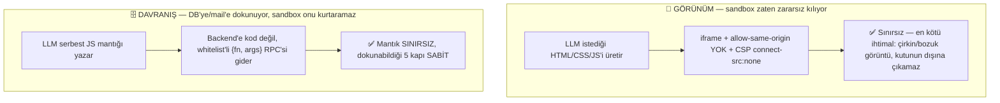
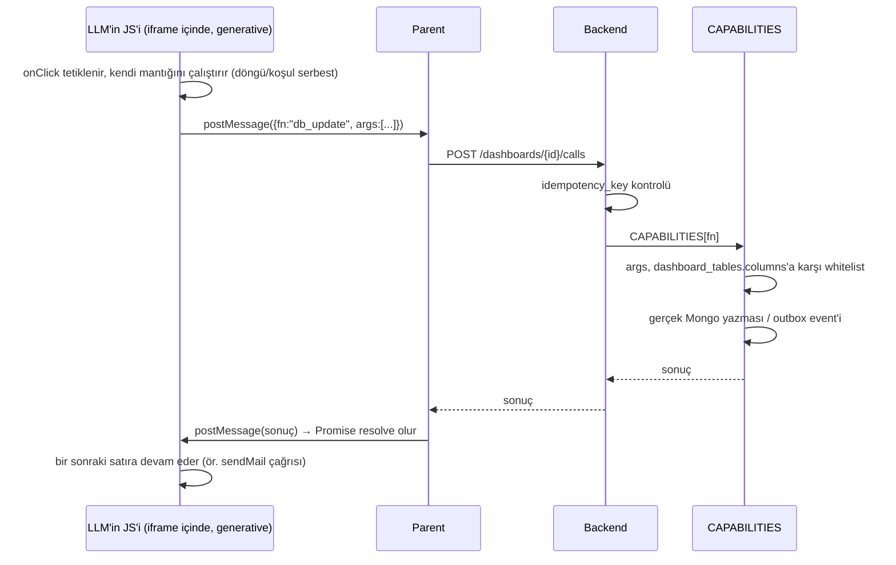

# Dashboard Capability Fonksiyonları ve Dinamik Tablo Kataloğu

## Bu sayfa neden var, ve [Dinamik Sorgu Ölçeklenmesi](/ai/dynamic-function-scaling)'nden farkı ne

Bu klasördeki diğer sayfalar (`ui-tree`, `registry`, `dynamic-function-scaling`) LLM'in **JSON UI ağacı** ürettiği, HTML'e hiç dokunmadığı bir mimariyi anlatıyor. Dashboard özelliği (`services/dashboard_html_service.py`, `dashboard_service.py`) fiilen farklı: kullanıcı doğrudan **LLM'in ürettiği HTML'i** görüyor — `NewPortal-Frontend/src/pages/ai-chat/DashboardHtmlFrame.tsx`'te `<iframe srcDoc={html} sandbox="allow-scripts">` (kasıtlı olarak `allow-same-origin` YOK). Bu iki sayfa çelişmiyor, iki ayrı ihtiyacı karşılıyor:

| | JSON UI Ağacı (`ui-tree`, `registry`) | HTML Dashboard (bu sayfa) |
|---|---|---|
| Kullanım yeri | Sohbet içi render | Kullanıcının "kendi panosu" dediği kalıcı sayfa |
| Şema garantisi | Kapalı component kataloğu | Açık uçlu HTML — güvenliği şema değil, sandbox veriyor |
| Neden bu tercih | — | Kullanıcı gerçekten serbest layout/görsel kompozisyon istiyor — bkz. `.knowledge/decisions/general/2026-08-31_dashboard-interactive-sandbox.md` |

## Kök ilke: sabit primitive + sınırsız kompozisyon

**"Tamamen esnek" olsun istiyoruz — ama esneklik iki farklı yerde yaşıyor, ikisi aynı kurala tabi değil:**



Bu, yeni icat edilen bir kısıtlama değil — **Excel'in, Zapier'in, Airtable'ın, Notion'ın kullandığı aynı model**: kullanıcı "sınırsız" hisseder (kombinasyon uzayı pratikte tükenmez), ama arkada sabit ve küçük (~10-20) bir primitive seti vardır. Gerçek anlamda sınırsız olan tek alternatif — LLM'in ürettiği kodun/SQL'in doğrudan çalıştırılması — kabul edilmedi, çünkü bu esneklik değil, güvenlik sınırının LLM'e devredilmesi demek.

## Katalog 1 — Tablo Kataloğu (tenant'ın kendi tanımladığı şema)

Kullanıcının "özel tablosu" runtime'da LLM tarafından tanımlanıyor (`"ürün adı/fiyat/stok kolonları olsun"`). Postgres migration'ı ile değil, **meta-şema** olarak Mongo'da tutuluyor:

```json
// dashboard_tables (meta-şema)
{
  "_id": "...", "tenant_id": "...", "dashboard_id": "...",
  "name": "urunler",
  "columns": [
    {"name": "urun_adi", "type": "string", "searchable": true},
    {"name": "fiyat", "type": "number", "filterable": true}
  ]
}
```

```json
// dashboard_table_rows (generic veri — tek koleksiyon, tablo başına AYRI koleksiyon açılmıyor)
{
  "_id": "...", "table_id": "...", "tenant_id": "...",
  "data": {"urun_adi": "...", "fiyat": 120},
  "is_deleted": false, "previous": null
}
```

`columns` listesi aynı zamanda **whitelist kaynağı** — her capability çağrısında `field`/`patch` anahtarları buna karşı doğrulanır.

## Katalog 2 — Capability Fonksiyonları (generative JS + RPC whitelist)

**Önceki tasarımın düzeltmesi:** "sabit step type listesi" (JSON pipeline) yerine, davranış tarafı da **görünüm kadar generative** — LLM her interaktif eleman için gerçek JS mantığı (döngü, koşul, sıralama) yazıyor, aynı HTML'i ürettiği gibi. Kısıtlama step tipinde değil, o JS'in **dokunabildiği yerde**.

**Kritik nokta: bu kod hiçbir zaman backend'de çalışmıyor.** LLM'in yazdığı JS zaten iframe'de (`sandbox="allow-scripts"`, ağ kapalı) çalışıyor — browser'ın kendisi sandbox. Backend'e kod hiç gitmiyor, sadece tek tek **fonksiyon çağrısı verisi** gidiyor.

```js
// LLM'in ürettiği JS — iframe İÇİNDE çalışır, mantık tamamen serbest
async function onClickKapat(rowId) {
  await dbUpdate("firsatlar", rowId, {asama: "kazanildi"});
  await sendMail({to_field: "musteri_email", template: "firsat_kazanildi"});
  await dbCreate("audit_log", {aksiyon: "firsat_kapandi"});
}
```

`dbUpdate`, `dbCreate`, `dbDelete`, `dbQuery`, `sendMail` — bunlar gerçek DB bağlantısı DEĞİL, biz iframe'e enjekte ettiğimiz (bootstrap script) ince sarmalayıcılar. Her biri sadece `postMessage` ile **veri** yolluyor, backend'den cevabı bekliyor:

```js
// Bootstrap script — LLM bunu yazmıyor, biz her HTML'e otomatik enjekte ediyoruz
function dbUpdate(table, rowId, patch) {
  return new Promise((resolve) => {
    const callId = crypto.randomUUID();
    postMessage({callId, fn: "db_update", args: [table, rowId, patch]}, "*");
    pendingCalls[callId] = resolve;   // backend cevabı postMessage ile dönünce resolve edilir
  });
}
```

### Backend tarafı — sadece 5 whitelist'li fonksiyon, kod hiç yok

```python showLineNumbers
CAPABILITIES: dict[str, "CapabilityHandler"] = {
    "db_update": UpdateRowHandler(),   # args: table_id, row_id, patch — columns'a karşı doğrular
    "db_create": CreateRowHandler(),   # args: table_id, row_data
    "db_delete": DeleteRowHandler(),   # args: table_id, row_id (soft-delete)
    "db_query":  QueryRowsHandler(),   # args: table_id, filters
    "send_mail": SendMailHandler(),    # args: to_field, template — outbox'a yazar, senkron göndermez
}

class CapabilityCall(BaseModel):
    call_id: str
    fn: Literal["db_update","db_create","db_delete","db_query","send_mail"]
    args: list

async def handle_call(call: CapabilityCall, tenant_id: UUID, idempotency_key: str) -> dict:
    if await already_executed(idempotency_key):     # çift tıklama / retry koruması
        return await get_cached_result(idempotency_key)
    handler = CAPABILITIES[call.fn]                              # bilinmeyen fn -> zaten şema reddeder
    parsed = handler.args_schema.model_validate(call.args)        # table_id/field'lar dashboard_tables.columns'a karşı whitelist
    result = await handler.run(tenant_id, parsed)
    await cache_result(idempotency_key, result)
    return result
```

Backend hiçbir zaman "LLM'in kodunu çalıştırmıyor" — sadece gelen `{fn, args}` verisini 5 sabit fonksiyondan birine eşleyip **kendi Python kodunu** çalıştırıyor. LLM'in yazdığı JS ne kadar karmaşık olursa olsun (döngü, çok adımlı koşul), backend'e ulaşan şey hep aynı basit, whitelist'lenebilir şekil.

### Akış



Bu tasarım, **her interaktif eleman için ayrı bir tetikleyici tanımına gerek bırakmıyor** — LLM tek bir `onClick` fonksiyonu içine istediği kadar `dbUpdate`/`sendMail` çağrısını istediği sırayla, istediği koşulla yazabiliyor. Kişiye özel olan artık ne "hangi step" ne de "hangi sıra" — doğrudan **JS'in kendisi**, tıpkı HTML gibi.

## İdempotency ve kısmi başarısızlık

Her `dbUpdate`/`sendMail` çağrısı ayrı bir RPC olduğu için ("onayla'ya 2 kere basıldı" ya da "1. çağrı geçti, 2. çağrı patladı"):

- **Çift çağrı** → her `postMessage` çağrısının kendi `call_id`'si var; backend aynı `call_id`'yi ikinci kez görürse çalıştırmaz, önceki sonucu döner.
- **`db_update` idempotent tasarlanır** → `asama="kazanildi"` set etmek kaç kere çalışırsa çalışsın aynı sonucu verir.
- **`send_mail` outbox'a yazılır** → senkron gönderilmez, mevcut `tenant_outbox_events`/`OutboxPoller`'ın at-least-once + retry mekanizması aynen kullanılır.
- **Rollback YOK — bilinçli bir sınır** → JS'in kendi akışı bir çağrıdan sonra durursa (ör. ağ hatası), önceki çağrılar geri alınmaz. Compensating transaction ayrı, ileri seviye bir konu — bugün kapsam dışı.

## Geri alınabilirlik (undo)

`db_update`/`db_delete` veriyi kalıcı silmiyor: `db_delete` → `is_deleted: true`; `db_update` → eski hâl `previous`'a kopyalanır. Tek seviye undo (event-sourcing değil) — MVP için yeterli.

## Kapsam dışı / açık noktalar

- **Rol bazlı kolon maskeleme** — [EDGE-CASE-032](/ai/dynamic-function-scaling#edge-case-032-kolon-bazlı-hassas-veri-maskeleme-yok) ile aynı boşluk.
- **Capability → yetki eşlemesi** — salt-okunur roller (`db_query` var, `db_update/create/delete` yok) henüz ayrılmadı.
- **`dashboard_tables` şemasının kim/ne zaman oluşturduğu** — LLM'in ilk istekte şemayı nasıl önereceği tasarlanmadı.
- **Kod tarafı** — bootstrap script'in `dbUpdate`/`sendMail` sarmalayıcıları, `POST /dashboards/{id}/calls` — hiçbiri henüz yazılmadı, bu sayfa tasarım kararı.

## Özet

- Davranış tarafı da görünüm gibi **generative** — LLM gerçek JS mantığı yazıyor, sabit "step type" enum'u yok.
- Bu JS **hiçbir zaman backend'de çalışmıyor** — browser'ın iframe sandbox'ında çalışıyor, zaten izole.
- Backend'e giden şey kod değil, tek tek **`{fn, args}` RPC çağrısı** — 5 sabit capability (`db_update`, `db_create`, `db_delete`, `db_query`, `send_mail`), her biri whitelist'ten geçiyor.
- Kişiye özel olan JS'in kendisi (mantık sınırsız); sabit olan JS'in dokunabildiği 5 kapı.
- Çift çağrı `call_id`/idempotency ile, harici yan etkiler outbox ile, rollback yok (bilinçli sınır).
