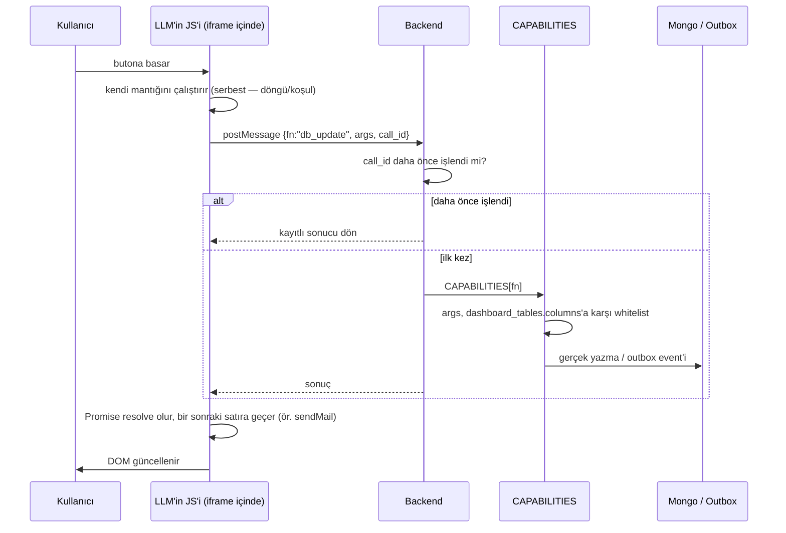

# Sistem Özeti: Lego Mantığı ve Tam Akış

Bu sayfa, [Dashboard Capability Fonksiyonları](/ai/dashboard-event-catalog) ve [Use Case: Scrum Board](/ai/usecase-scrumboard)'daki detaylı tasarımın **tek sayfalık, sunuma hazır özeti**. Detay için o sayfalara bak — burada sadece "ne, neden, nasıl" var.

## 1 — Kök ilke: Lego

Bir Lego setinde parça sayısı sabittir (birkaç tuğla türü), ama kurulabilecek yapı sayısı sonsuzdur. Sistem aynı mantıkla çalışıyor — ama Lego parçası "adım tipi" değil, **kodun dokunabildiği kapı**:

| | Lego | Bizim sistem |
|---|---|---|
| Sabit parça | tuğla türleri (~10) | **5 capability fonksiyonu** (`db_update`, `db_create`, `db_delete`, `db_query`, `send_mail`) |
| Kim parça icat ediyor | kimse — parçalar zaten var | kimse — LLM yeni capability **icat edemiyor** |
| Sınırsız olan | kurulabilecek yapı | **LLM'in yazdığı JS mantığı** (döngü, koşul, sıra — HTML kadar serbest) |
| Neden güvenli | — | JS hiç backend'de çalışmıyor; her capability çağrısı `{fn, args}` verisi olarak whitelist'ten geçiyor |

**Neden bu ve neden ham SQL/keyfi kod değil:** "Kişiye tamamen esnek" olsun istiyoruz ama LLM'in ürettiği kodun/SQL'in doğrudan DB'ye dokunmasına izin veremeyiz. Çözüm kodu kısıtlamak değil — **kodun çalıştığı yeri** (browser'ın zaten izole ettiği iframe) ve **dokunabildiği kapıyı** (5 fonksiyon) kısıtlamak. Excel'in sabit ~500 fonksiyonla sınırsız hesap tablosu kurdurması aynı model — kullanıcı hiçbir zaman "sınıra çarptım" hissetmiyor.

## 2 — Sistemin 7 parçası

```mermaid
flowchart TB
    subgraph FE["Frontend / Browser"]
        F1["1️⃣ DashboardHtmlFrame.tsx\niframe, sandbox=allow-scripts\n✅ zaten kodda var"]
        F2["2️⃣ LLM'in JS'i + enjekte edilen\ndbUpdate/sendMail sarmalayıcıları"]
    end
    subgraph BE["Backend"]
        B1["3️⃣ dashboard_html_service\nLLM'e HTML+JS ürettirir"]
        B2["4️⃣ POST /dashboards/{id}/calls\ntek giriş noktası"]
        B3["5️⃣ idempotency store\n(call_id ile çift çağrı koruması)"]
        B4["6️⃣ CAPABILITIES registry\n5 sabit, whitelist'li handler"]
    end
    subgraph DATA["Veri"]
        D1[("dashboard_tables\nşema/whitelist")]
        D2[("dashboard_table_rows\ngeneric veri")]
        D3[("7️⃣ tenant_outbox_events\n+ OutboxPoller\n✅ zaten kodda var")]
    end

    B1 -->|HTML+JS üretir| F1
    F1 --> F2
    F2 -->|postMessage: {fn, args}| B2
    B2 --> B3 --> B4
    B4 -->|whitelist kontrolü| D1
    B4 -->|db_update/create/delete/query| D2
    B4 -->|send_mail| D3
```

İki parça (**iframe** ve **outbox**) zaten kodda var, yeni bir şey gerekmiyor. Kalan 5 parça küçük, sınırları net, tasarımı bitmiş — henüz yazılmadı.

## 3 — Uçtan uca akış



## 4 — "Kişiye özel" olan kesin olarak nerede

```js
// Bu, kişiye özel olan TEK yer — JS mantığının kendisi, sabit şablon değil:
async function onClickKapat(rowId) {
  await dbUpdate("firsatlar", rowId, {asama: "kazanildi"});
  await sendMail({to_field: "musteri_email", template: "firsat_kazanildi"});
  await dbCreate("audit_log", {aksiyon: "firsat_kapandi"});
}
```

LLM her kullanıcı isteğinde **bu JS'i** üretiyor — kaç çağrı, hangi sırada, hangi koşulla. `CAPABILITIES` registry'si, `dashboard_tables` şeması, whitelist mantığı — hepsi **sabit backend kodu**, hiç değişmiyor. Değişen sadece bu JS.

## Canlı dene

- [Use Case: Scrum Board](/ai/usecase-scrumboard) — sürükle-bırak mockup + **Event Pipeline Builder** (farklı CRM/ERP senaryolarını canlı çalıştırabildiğin interaktif demo — adım/param modeli basitleştirilmiş anlatım amaçlı, gerçek mekanizma yukarıdaki gibi generative JS + RPC)
- [Dashboard Capability Fonksiyonları ve Dinamik Tablo Kataloğu](/ai/dashboard-event-catalog) — tam teknik tasarım, injection güvenliği, idempotency detayları
