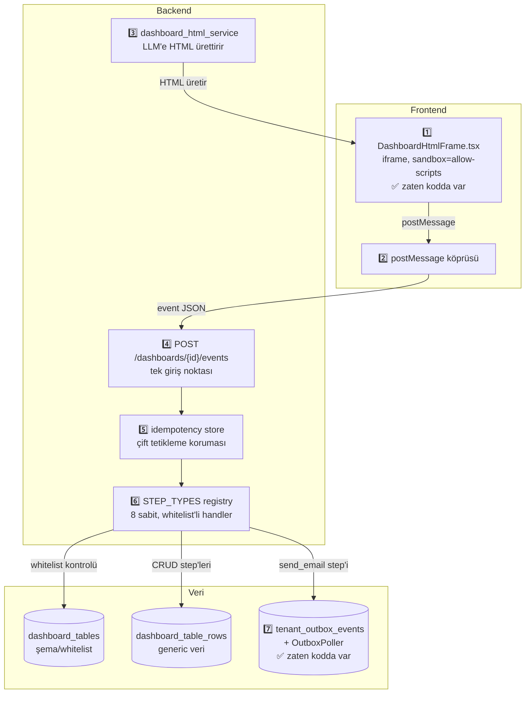
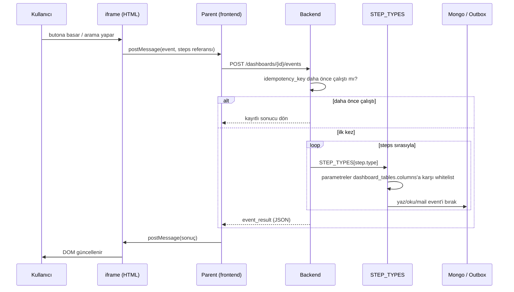

# Sistem Özeti: Lego Mantığı ve Tam Akış

Bu sayfa, [Dashboard Event Kataloğu](/ai/dashboard-event-catalog) ve [Use Case: Scrum Board](/ai/usecase-scrumboard)'daki detaylı tasarımın **tek sayfalık, sunuma hazır özeti**. Detay için o sayfalara bak — burada sadece "ne, neden, nasıl" var.

## 1 — Kök ilke: Lego

Bir Lego setinde parça sayısı sabittir (birkaç tuğla türü), ama kurulabilecek yapı sayısı sonsuzdur. Sistem aynı mantıkla çalışıyor:

| | Lego | Bizim sistem |
|---|---|---|
| Sabit parça | tuğla türleri (~10) | **step tipi** (8 tane: listele, ara, ekle, güncelle, sil, mail gönder, koşul, hesapla) |
| Kim parça icat ediyor | kimse — parçalar zaten var | kimse — LLM yeni step tipi **icat edemiyor** |
| Sınırsız olan | kurulabilecek yapı | **step'lerin dizilimi** (sıra + parametreler) |
| Neden güvenli | — | her step, tenant'ın kendi tablo şemasına karşı whitelist'ten geçiyor |

**Neden bu ve neden ham SQL/keyfi kod değil:** "Kişiye tamamen esnek" olsun istiyoruz ama LLM'in ürettiği kodun/SQL'in doğrudan DB'ye dokunmasına izin veremeyiz — bu esneklik değil, güvenlik sınırının LLM'e devri olur. Excel'in sabit ~500 fonksiyonla sınırsız hesap tablosu kurdurması, Zapier'in sabit ~30 "block" ile sınırsız otomasyon kurdurması aynı model — kullanıcı hiçbir zaman "sınıra çarptım" hissetmiyor çünkü kombinasyon uzayı pratikte tükenmiyor.

## 2 — Sistemin 7 parçası



İki parça (**iframe** ve **outbox**) zaten kodda var, yeni bir şey gerekmiyor. Kalan 5 parça küçük, sınırları net, tasarımı bitmiş — henüz yazılmadı.

## 3 — Uçtan uca akış



## 4 — "Kişiye özel" olan kesin olarak nerede

```json
// Bu, kişiye özel olan TEK yer — kod değil, veri:
{
  "trigger": {"type": "button_click", "element_id": "btn-onayla"},
  "steps": [
    {"type": "update_row", "params": {"table_id": "siparisler", "patch": {"durum": "onaylandi"}}},
    {"type": "send_email", "params": {"to_field": "musteri_email", "template": "siparis_onay"}},
    {"type": "create_row", "params": {"table_id": "audit_log", "row_data": {"aksiyon": "onay"}}}
  ]
}
```

LLM her kullanıcı isteğinde **bu JSON'u** üretiyor — hangi step'ler, hangi sırada, hangi tablo/alan. `STEP_TYPES` registry'si, `dashboard_tables` şeması, whitelist mantığı — hepsi **sabit kod**, hiç değişmiyor. Değişen sadece bu JSON.

## Canlı dene

- [Use Case: Scrum Board](/ai/usecase-scrumboard) — sürükle-bırak mockup + **Event Pipeline Builder** (4 farklı dashboard/istek senaryosunu preset olarak yükleyip canlı çalıştırabildiğin interaktif demo)
- [Dashboard Event Kataloğu ve Dinamik Tablo Kataloğu](/ai/dashboard-event-catalog) — tam teknik tasarım, injection güvenliği, idempotency detayları
