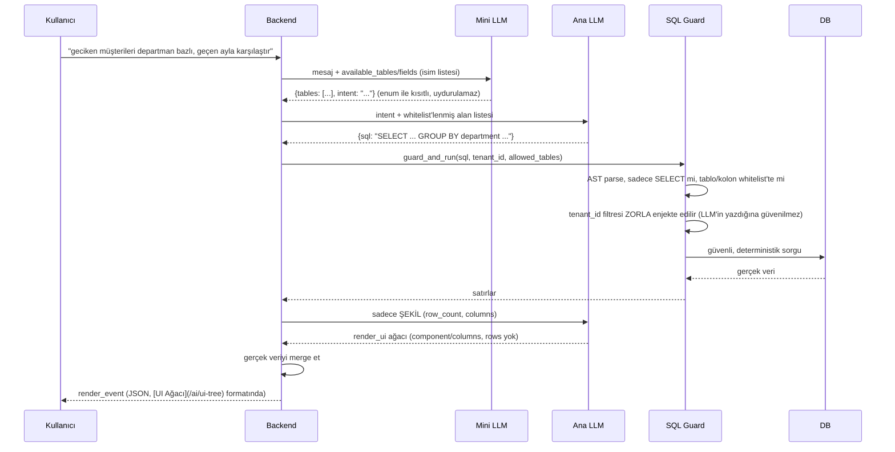

# Dinamik Sorgu Ölçeklenmesi — Sabit Fonksiyondan SQL Guard'a

## Karar (özet)

**Sorun:** Katalog iki ayrı yerde istek yelpazesini kısıtlıyor — (1) **fonksiyon/veri tarafı**: her iş sorusu için ayrı `TOOL_REGISTRY` girdisi gerekiyor, kombinasyon (kırılım × filtre × karşılaştırma) arttıkça patlıyor; (2) **UI/component tarafı**: her görsel tip için ayrı component gerekiyor, kataloğda olmayan bir gösterim istendiğinde LLM `enum` kısıtı yüzünden zorunlu olarak **en yakın ama yanlış** component'i seçiyor, sessizce hatalı sonuç üretiyor.

**Çözüm (karara bağlandı):**

| Taraf | Kısıtlayan şey | Çözüm | Nasıl çalışacak |
|---|---|---|---|
| Fonksiyon/veri | Sabit fonksiyon = sabit soru | `TOOL_REGISTRY` yanına **SQL Guard** yolu eklenir | LLM tablo/kolon seçip SQL üretir, AST parse + whitelist + zorunlu `tenant_id` enjeksiyonundan geçer. Yazma işlemleri/kritik-yol raporlar `TOOL_REGISTRY`'de kalır, açık uçlu raporlama SQL Guard'a gider — routing LLM'e değil deterministik intent-eşlemesine bırakılır. |
| UI/component | Her görsel tip = ayrı component | "Chart tipi" değil **mark + encoding gramerine** geçilir (Vega-Lite/grammar-of-graphics deseni) + kataloğa son çare `Unsupported` girişi eklenir | ~6-8 mark (bar/line/point/area/rect/arc) × ~7-8 encoding kanalı (x/y/color/size/order/tooltip) kombinasyonu funnel/heatmap/Gantt'ın çoğunu yeni component yazmadan kapsar — katalog "kaç chart tipi var" değil "kaç mark/encoding var" ile ölçeklenir, ikisi de neredeyse hiç büyümez. `Unsupported` sadece gramerin gerçekten dışına çıkan taleplerde (harita, video vb.) devreye girer. |

**Neden HTML değil:** İkisi de HTML'e geçilerek çözülmüyor — sorun render formatı değil, kataloğun **kapsam** genişliği. HTML'e geçmek şema garantisini/XSS güvenliğini kaybettirir, kapsam sorununu çözmez.

**Etki:** `sql_guard.py` (yeni AST parser bağımlılığı) + `COMPONENTS_CATALOG` yeniden modellenmesi + intent→yol routing kuralı (merkezi policy'den türer) gerekiyor. Detay, gerekçe ve alt edge case'ler (EDGE-CASE-030 → 035) aşağıda.

---

## Bu sayfa neden var

Bir tartışmada şu istek geldi: "JSON yerine HTML basalım, dashboard'u kişi kendi isteğine göre kursun." Bu isteğin yüzeydeki talebi (HTML) yanlış hedef — [Genel Bakış](/ai/overview) ve [Neden LLM'e Ham Veri/Endpoint Vermiyoruz](/ai/why-no-raw-data)'da anlatılan sebeplerle LLM'e serbest metin/markup yazdırmak şema garantisini ve XSS güvenliğini baştan kaybettiriyor. Ama talebin **altında yatan gerçek endişe haklı**: mevcut [Katalog / Registry](/ai/registry) modeli, her iş sorusu için önceden yazılmış bir fonksiyon (`TOOL_REGISTRY`) varsayıyor — kullanıcı "geçen ayla karşılaştır", "departman bazlı kır", "üstüne bir de filtre ekle" dediğinde bu kombinasyonların her biri için ayrı fonksiyon yazmak gerekir. Bu sayfa, **"HTML" yanlış çözümünü** bir kenara koyup **gerçek soruna** (sabit fonksiyon kataloğu, açık uçlu istek yelpazesiyle ölçeklenmiyor) [Güvenlik Modeli](/ai/security-model)'nin "İleri seviye alternatif" bölümünde kısaca değinilen çözümü uçtan uca detaylandırıyor.

## Sorun tespiti

### Neden "HTML basalım" yanlış hedef

| İddia | Gerçek |
|---|---|
| "HTML ile daha dinamik olur" | Dinamiklik zaten [UI Ağacı](/ai/ui-tree)'ndaki `Row`/`Grid`/`Column` + `children` ile var — component kompozisyonu sınırsız, sınırlı olan sadece component **setinin kendisi** (bilinçli güvenlik sınırı) |
| "HTML'de metadata derdi olmaz" | Olur — hangi veri nereye bağlanacak, hangi kolon geldi, child nerede bilgisini HTML'de de bir yerde tutman gerekir; bu zaten JSON'un yaptığı iş, HTML'e geçince aynı işi daha kırılgan bir formatta (string parse, kaçış karakterleri, XSS) tekrar yapmış olursun |
| "Kişi kendi dashboard'unu kursun" | Bu bir **render** sorunu değil, bir **veri sorgusu** sorunu — kullanıcı yeni bir görsel düzenlemek değil, yeni bir soruya cevap istiyor (bkz. aşağıdaki asıl sorun) |

### Asıl sorun: sabit fonksiyon kataloğu kombinatoryal patlama yaşıyor

`TOOL_REGISTRY`'deki her girdi (`get_overdue_customers` gibi) **tek bir önceden bilinen soruyu** karşılıyor. Kullanıcının isteyebileceği kırılım/filtre/karşılaştırma kombinasyonu teorik olarak sınırsızken, bu modelde her yeni kombinasyon = yeni fonksiyon = yeni kod = yeni deploy demek:

```text
"ödemesi geciken müşteriler"                    -> get_overdue_customers()
"ödemesi geciken müşteriler, departman bazlı"    -> ??? (yeni fonksiyon mu?)
"...geçen ayla karşılaştırmalı"                  -> ??? (yeni fonksiyon mu?)
"...sadece Enterprise plandakiler"               -> ??? (yeni fonksiyon mu?)
"...son 3 ayın trendiyle birlikte"               -> ??? (yeni fonksiyon mu?)
```

4 boyut (kırılım, karşılaştırma, filtre, zaman aralığı) bile kombinatoryal olarak onlarca fonksiyona katlanıyor. Bu, katalog kısıtlıyor hissinin **doğru kaynağı** — ama çözüm katalogu kaldırmak (HTML) değil, kısıtı **doğru seviyeye** taşımak.

## Çözüm: primitive'i sabitle, kombinasyonu LLM'e bırak

### Temel fikir

Fonksiyon başına bir iş sorusu yazmak yerine, LLM'e sabit sayıda **tablo/kolon** (semantic layer) veriyoruz; LLM bunları birleştirip **SQL üretiyor**. Kataloğun büyüklüğü artık "kaç farklı soru sorulabilir" ile değil, "kaç tablo/kolon var" ile orantılı — 200 tablo × 500 alan sabit kalırken, bunlardan üretilebilecek sorgu kombinasyonu pratik olarak sınırsız.

Bu, sıfırdan icat edilen bir şey değil — endüstride **text-to-SQL + semantic layer** pattern'i olarak biliniyor, ürünleşmiş halleri var: Snowflake Cortex Analyst, ThoughtSpot Spotter, Looker'ın conversational analytics'i, Amazon Q, Power BI Copilot. Hiçbiri LLM'e serbest HTML/kod yazdırmıyor — hepsi LLM'in **kısıtlı bir şema üzerinde sorgu kurmasına** izin verip o sorguyu ayrı bir guard katmanından geçiriyor.

### Pipeline — [Sorgu Pipeline'ı](/ai/query-pipeline)'nın genişletilmiş hali

Bu akış zaten `query-pipeline.mdx`'te adım 1-2 olarak var; burada tam mimari olarak konumlandırıyoruz:



Kritik nokta: bu akış [Güvenlik Modeli](/ai/security-model)'ndeki **beş katmanlı savunmayı** aynen koruyor — LLM burada da sadece isim/SQL **önerir**, çalıştırma kararı hep backend'de, `tenant_id` hep JWT'den deterministik enjekte edilir, gerçek veri LLM'in konuşma geçmişine hiç girmez. Değişen tek şey: LLM'in seçtiği şey artık "hangi hazır fonksiyon" değil, "hangi tablo/kolon/agregasyon kombinasyonu."

### Hibrit model — ikisini birden tutuyoruz, biri diğerinin yerine geçmiyor

| | `TOOL_REGISTRY` (sabit fonksiyon) | SQL Guard (üretilen sorgu) |
|---|---|---|
| Ne zaman kullanılır | Yazma işlemleri (davet gönder, tenant oluştur, kayıt güncelle) ve sık tekrar eden, kritik-yol raporlar | Açık uçlu, önceden öngörülemeyen raporlama/dashboard sorguları |
| Güvenlik sınırı | Whitelist (isim var mı) | Whitelist + AST parse (üstüne bir katman) |
| Yeni senaryo eklemek | Kod yaz, deploy et | Otomatik — LLM yeni kombinasyonu kataloğun izin verdiği tablo/kolonlardan kurar |
| Risk profili | Düşük (davranış sabit, test edilebilir) | Orta-yüksek (Guard'ın doğruluğu kritik güvenlik sınırı hâline gelir) |

`security-model.mdx`'in kendi uyarısı geçerli: "Guard katmanının doğruluğu artık kritik güvenlik sınırı hâline gelir — AST parse'daki bir hata doğrudan güvenlik açığı demektir." Bu yüzden **yazma işlemleri ve kritik-yol okuma işlemleri `TOOL_REGISTRY`'de kalır**, sadece "kullanıcı ne isterse" tipi serbest raporlama SQL Guard yoluna gider. İki sistem paralel yaşar, birbirini ikame etmez.

### Token maliyeti — ayrı bir eksen, ayrı bir çözümü var

Semantic layer (200 tablo × 500 alan) büyüdükçe "tam kataloğu her istekte gönder" yaklaşımı kırılır — bu zaten [Ölçeklenme (Cache, Embedding, Boş Sonuç)](/edge-cases/catalog-retrieval/scaling) sayfasında EDGE-CASE-022 olarak işaretli. Çözüm kataloğu küçültmek değil, **embedding-based retrieval**: her istekte tam şema değil, mesaja semantik olarak en yakın `top_k` tablo/alan gönderilir. Yani:

- **Yelpaze/kısıtlama derdi** → semantic layer + SQL Guard (bu sayfa)
- **Token maliyeti derdi** → embedding retrieval + prompt caching ([Prompt Caching](/cost-management/prompt-caching))

İkisi birbirinden bağımsız eksenler — biri diğerinin çözümü değil, ikisi birlikte gerekir.

## İkinci soru: kataloğda olmayan bir gösterim istenirse ne olur

Yukarıdaki SQL Guard çözümü "hangi **veri**" sorusunu çözüyor — "hangi **gösterim**" (Gantt chart, heatmap, funnel, takvim görünümü gibi [Components Catalog](/ai/registry#2-components-catalog--llmin-seçebileceği-ui-parçaları)'nda hiç tanımlı olmayan bir component tipi) sorusu ayrı, çözülmemiş bir eksen. Hoca'nın asıl sorduğu soru bu.

### Şu an ne oluyor

`COMPONENTS_CATALOG` bir Python sözlüğü, sabit ve derleme zamanında belli. Native tool calling'de `render_ui` çağrısının `component` alanı `enum: list(CATALOG.keys())` ile kısıtlanıyor ([Katalog / Registry](/ai/registry#katalogdan-native-tool-schemaya)'daki `tool_choice` zorlamasıyla aynı mekanizma). Bunun sonucu: LLM **kataloğda olmayan bir component ismi üretemez** — API seviyesinde engelleniyor. Ama bu "hata verir" anlamına gelmiyor; LLM zorunlu olarak enum içinden **en yakın** olanı seçmek zorunda kalıyor.

```text
Kullanıcı: "satış hunisini (funnel) göster"
CATALOG'da funnel yok, sadece DataTable/LineChart/StatCard/Row/Grid/Column var
LLM zorunlu seçim yapmalı -> muhtemelen LineChart ya da DataTable seçer
Kullanıcı huni değil, alakasız bir grafik/tablo görür — hata yok, yanlış sonuç var
```

Bu, [Ölçeklenme](/edge-cases/catalog-retrieval/scaling) sayfasındaki EDGE-CASE-026'nın (düşük güvenilirlikli sonucun sessizce kullanılması) UI seçimi tarafındaki karşılığı — **sessiz, kendinden emin görünen ama yanlış bir render**, boş/hata sonucundan daha tehlikeli çünkü kullanıcı bunun bir uyumsuzluk olduğunu fark etmeyebilir.

### EDGE-CASE-035: Component Kataloğunda "Uygun Eşleşme Yok" Sinyali Bulunmuyor

**Risk: Orta-Yüksek.** `render_ui` şeması LLM'e "bunlardan hiçbiri uymuyor" deme seçeneği vermiyor — enum zorunlu, bir şey seçmek zorunda. Veri tarafında (mini LLM'in tablo/alan seçimi) da aynı yapısal eksiklik var ama orada en azından düşük skor bir sinyal olarak *hesaplanabilir* (embedding benzerlik skoru); component seçiminde skor kavramı bile yok, enum içinden zorunlu seçim var. **Bu bölümün geri kalanı bu edge case'i asıl çözen mekanizmayı anlatıyor — `Unsupported` sadece o mekanizmanın da yetmediği son çare.**

### Asıl çözüm: "chart tipi" kataloglamayı bırak, "mark + encoding" gramerine geç

Bir önceki taslak ("tek `Chart` component'i, `chart_type: line|bar|pie|...` enum'u") aslında sorunu çözmüyor — yine "her yeni görsel tip = enum'a yeni satır ekle" demek, sadece dosya sayısını 1'e indiriyor, kombinatoryal sınırı kaldırmıyor. Funnel/Gantt/heatmap gelince yine `Unsupported`'a düşüyorsun. Bunun **SQL Guard'daki gerçek karşılığı** şu: SQL Guard "her soruyu kataloglama, tablo+kolon+agregasyon primitive'lerini kataloğla, LLM'in bunları birleştirmesine izin ver" dedi. Chart tarafında aynı seviyeye inmek, "chart tipi" değil **mark + encoding** kataloglamak demek — bu, Vega-Lite/Observable Plot gibi "grammar of graphics" kütüphanelerinin çözdüğü, endüstride hazır bir problem:

```python showLineNumbers
# "Chart tipi" kataloglamak yerine — mark ve encoding kanalları kataloglanır
CHART_GRAMMAR_CATALOG = {
    "marks": ["bar", "line", "point", "area", "rect", "arc"],       # sabit, ~6-8 tane, nadiren büyür
    "encodings": ["x", "y", "x2", "color", "size", "order", "tooltip"],  # sabit kanal seti
}

# LLM'in ürettiği JSON — chart tipi değil, mark+encoding kombinasyonu:
{
  "mark": "bar",
  "encoding": {
    "x": {"field": "stage", "type": "ordinal"},
    "y": {"field": "count", "type": "quantitative"},
    "order": {"field": "stage_order"}
  }
}
# -> stacked/sıralı bar = FUNNEL   (ayrı bir "Funnel" component'i yazmadan)
# "rect" mark + x/y/color encoding = HEATMAP
# "bar" mark + x/x2 encoding      = GANTT (interval bar)
```

Bu neden çalışıyor: `mark` (~6-8 sabit tip) ve `encoding` kanalı (~7-8 sabit kanal) **kombinasyonu** onlarca görünür chart tipini kapsıyor — funnel, heatmap, Gantt'ın çoğu "yeni component" değil, **var olan mark+encoding'in farklı bir kombinasyonu**. Katalog artık "kaç chart tipi var" değil "kaç mark + kaç encoding kanalı var" ile ölçekleniyor — bu ikisi neredeyse hiç büyümez, kombinasyon LLM'in işi. Backend tarafı da aynı güvenlik modelini korur: `mark` ve her `encoding` alanı ayrı ayrı whitelist + Pydantic şemasından geçer (bkz. [UI Ağacı](/ai/ui-tree)'ndaki `validate_and_resolve` ile aynı desen), render eden kütüphane (Vega-Lite ya da Recharts üstüne yazılmış ince bir adaptör) **deklaratif spec'i** işler — LLM hâlâ hiç kod/HTML yazmıyor, sadece whitelist'li bir gramerde spec kuruyor.

### `Unsupported` artık ne zaman devreye giriyor

Mark+encoding gramerine geçtikten sonra `Unsupported`, "yaygın bir chart tipini unuttuk" durumunu değil, gerçekten **gramerin dışına çıkan** istekleri karşılıyor — interaktif harita, video/medya gömme, üçüncü parti widget gibi grammar-of-graphics kapsamına hiç girmeyen taleplerde. Bunlar gerçekten geliştirici işi (yeni bir component yazılıp registry'ye eklenir); grafik/tablo/dashboard talebi olduğu sürece mark+encoding kombinasyonu bunu neredeyse hep karşılar, `Unsupported`'a düşme oranı ciddi şekilde azalır. Kişi görseli/avatar gibi isteklerin gramerdeki karşılığı, gramerin de yetmediği niş çizim istekleri için bir alt katman, ve `Unsupported`'a düşme oranını daha da azaltan alan tasarımı kararları için bkz. [Görsel Primitive'ler](/ai/visual-primitives). Zaten render edilmiş bir ağacın "şunu değiştir" diyerek düzenlenmesi (mekanizma + gerçek gecikme profili) için bkz. [Diyalog ile Revizyon](/ai/dynamic-revision).

### Yeni bir mark/encoding'in kataloğa girmesi — bilinçli bir sürtünme, bug değil

Retool, Metabase, Looker gibi ürünler de aynı yaklaşımı kullanıyor: ajan/LLM çalışma anında yeni bir görsel component **icat etmiyor**, sabit bir gramer (mark+encoding ya da benzeri) üzerinde kombinasyon kuruyor; gramerin kendisi (yeni bir `mark` tipi) nadiren, bilinçli bir geliştirici sürecinden geçerek büyür — [Katalog / Registry](/ai/registry#isimlendirme-kuralı)'daki süreçle aynı (hem katalog hem gerçek renderer'a eklenmesi). Bu sürtünme güvenlik modelinin bir parçası; giderilecek olan `Unsupported`'a düşme *oranı*, sürtünmenin kendisi değil.

## Bu yaklaşımın getirdiği yeni edge case'ler

`TOOL_REGISTRY`'den SQL Guard'a geçiş, [render_service edge case'lerinden](/edge-cases/render-service/overview) farklı, kendine özgü riskler taşıyor — henüz hiçbiri çözülmedi:

### EDGE-CASE-030: Subquery/CTE ile Tablo Whitelist Atlatma

**Risk: Yüksek.** `sql_guard.py`'daki `ast.referenced_tables.issubset(allowed_tables)` kontrolü, parser'ın nested subquery ve CTE (`WITH ... AS`) içindeki tablo referanslarını da doğru şekilde topladığını varsayıyor. AST parser bu düzeyleri eksik dolaşırsa, whitelist dışı bir tablo bir subquery içine gizlenerek kontrolü atlatabilir.

```text
-- Üst seviye sorgu whitelist'teki "invoices" tablosunu kullanıyor gibi görünür
SELECT * FROM invoices WHERE customer_id IN (
    SELECT id FROM users WHERE role = 'admin'   -- "users" whitelist'te yoksa
)                                                 -- parser bunu yakalıyor mu?
```

Çözüm yönü: AST doğrulaması `referenced_tables`'ı **tüm** nested seviyelerde (subquery, CTE, `UNION`, `JOIN` zincirleri) recursive topladığını garanti eden bir test seti ile doğrulanmalı — tek bir "düz sorgu" testi yeterli değil.

### EDGE-CASE-031: Agregasyon/JOIN ile Kaynak Tüketimi (DoS)

**Risk: Orta-Yüksek.** Guard sadece `SELECT` + tablo whitelist kontrol ediyor, sorgunun **maliyetini** kontrol etmiyor. LLM, whitelist'teki tabloları büyük bir Cartesian join'e sokan ya da milyonlarca satırı `GROUP BY` ile kıran bir sorgu üretebilir — teknik olarak whitelist'i hiç ihlal etmeden veritabanını kilitleyebilir.

```text
-- Her iki tablo da whitelist'te, JOIN koşulu eksik/gevşek
SELECT * FROM customers c, invoices i   -- implicit cross join, milyonlarca satır
```

Çözüm yönü: sorgu çalıştırılmadan önce `EXPLAIN` ile tahmini maliyet kontrolü, zorunlu `LIMIT` enjeksiyonu (client tarafı row limit'in bu versiyonu — bkz. [Client-Side Render Sağlamlığı](/edge-cases/render-service/client-rendering) EDGE-CASE-029), sorgu başına timeout.

### EDGE-CASE-032: Kolon Bazlı Hassas Veri Maskeleme Yok

**Risk: Yüksek.** Whitelist tablo/kolon **var/yok** seviyesinde çalışıyor — bir kolonun (`salary`, `tc_no`, `iban`) rol bazlı **kısmen** görünür olması (ör. sadece toplamı görünsün, tekil değer görünmesin) desteklenmiyor. Bir kullanıcı tabloya erişimi varsa, o tablodaki her whitelist'li kolonu ham hâliyle görebiliyor.

Çözüm yönü: kolon whitelist'i `visible` / `aggregate_only` / `masked` gibi bir erişim seviyesiyle genişletilmeli; Guard, `aggregate_only` işaretli bir kolonun `SELECT` listesinde çıplak (agregasyon fonksiyonu olmadan) geçmesini reddetmeli.

### EDGE-CASE-033: İki Kataloğun (Fonksiyon Whitelist + Tablo/Kolon Whitelist) Senkron Kalması

**Risk: Orta.** Hibrit modelde artık iki ayrı whitelist kaynağı var: `TOOL_REGISTRY`'nin bildiği yetki modeli ile SQL Guard'ın `allowed_tables`/rol bazlı kolon izinleri **aynı kaynaktan** türemezse, biri güncellenip diğeri unutulduğunda tutarsız yetki durumu oluşur (ör. bir tablo `TOOL_REGISTRY` tarafında erişilemezken SQL Guard tarafında erişilebilir kalabilir).

Çözüm yönü: rol → tablo/kolon/fonksiyon erişim eşlemesi **tek bir merkezi policy kaynağından** ([Platform Admin Policy Model](/services/platform-admin/policy-model) ile aynı yerden) türetilmeli, iki whitelist ayrı ayrı elle bakımlı olmamalı.

### EDGE-CASE-034: Routing Kararı — Hangi İstek Hangi Yola Gidecek?

**Risk: Orta.** Hibrit modelde bir isteğin `TOOL_REGISTRY`'ye mi yoksa SQL Guard yoluna mı gideceğine kim, nasıl karar veriyor henüz tanımlı değil. Bu karar LLM'e bırakılırsa, LLM kritik bir yazma işlemini yanlışlıkla SQL Guard yoluna (salt-okunur olması gereken bir yol) yönlendirebilir ya da tersi.

Çözüm yönü: routing LLM kararına bırakılmamalı — `intent_detection` adımının çıktısı (`docs/ai/query-pipeline.mdx` adım 1) deterministik bir kural motoruyla (ör. `intent` bir yazma fiiliyle eşleşiyorsa her zaman `TOOL_REGISTRY`'ye, salt-okunur bir rapor deseniyle eşleşiyorsa SQL Guard'a) eşlenmeli; LLM sadece hangi `intent` olduğunu öneriyor, hangi yola gideceğine backend karar veriyor.

## Üçüncü soru: katalog/gramer hiçbir zaman "tam" olmayacak, o zaman?

Yukarıdaki iki çözüm (SQL Guard, mark+encoding grameri) kataloğun kapsamını genişletiyor ama **sonsuza kadar tam olamaz** — kullanıcılar zamanla hep yeni bir şey isteyecek. Bunun kanıtı, mark+encoding grameri kadar "doğru" bir çözümde bile çıktı: LLM `bar + x/y/order` kombinasyonunu doğru kursa bile, bunun **görsel olarak** tanınabilir bir huni gibi durması (ortalanmış, daralan) ayrı bir garanti — gramer veri ilişkisini doğru kuruyor, görsel konvansiyonu değil. Yani "gramer her kombinasyonu üretebiliyor" ile "her kombinasyon kullanıcının kastettiği gibi görünüyor" aynı şey değil. Bu yüzden tek seferlik bir mimari karar yeterli değil, **sürekli işleyen bir büyüme süreci** gerekiyor:

### Archetype katmanı — LLM ham gramerle değil, doğrulanmış paketlerle çalışır

`render_ui` şemasına üçüncü bir seviye eklenir: LLM `mark`/`encoding`'i sıfırdan kurmaz, isimlendirilmiş bir **archetype** seçer (`funnel`, `heatmap`, `trend_comparison`, `kpi_grid`...). Her archetype, bir insan tarafından bir kere doğrulanmış sabit bir `mark + encoding + stil` paketine karşılık gelir — LLM'in her seferinde doğru görsel konvansiyonu (ortalama, sıralama, renk yönü) yeniden icat etmesi gerekmez, sadece hangi archetype'ın isteğe uyduğuna karar verir. Yeni bir archetype eklemek ucuzdur — var olan `mark`/`encoding` primitive'lerinin yeni bir kombinasyonudur, yeni bir React component'i yazmak değil.

### Telemetri + backlog — katalog büyümesi tahminle değil, gerçek taleple yönetilir

Hem UI tarafında (`Unsupported` seçimi ya da düşük güvenilirlikli zorunlu eşleşme) hem veri tarafında (SQL Guard'ın whitelist dışı diye reddettiği istekler) her olay, kullanıcının **orijinal doğal dil isteğiyle birlikte** loglanır. Belirli bir eşiğe ulaşan pattern (ör. bir ayda N kez aynı karşılanmamış istek), deliberate bir kararla yeni archetype/tablo/mark olarak kataloğa eklenir. Bu, [EDGE-CASE-035](#edge-case-035-component-kataloğunda-uygun-eşleşme-yok-sinyali-bulunmuyor)'teki `Unsupported` sinyalini tek başına bir "hata mesajı" olmaktan çıkarıp bir **veri kaynağına** çevirir — şema, yazma noktaları ve review eşiği için bkz. [Katalog Boşluğu Takibi](/ai/catalog-gap-tracking).

### Bu bir mimari karar değil, tekrarlayan bir operasyon

Kim review ediyor, ne sıklıkla, hangi eşik yeni bir katalog girdisini tetikliyor — bunlar implementasyondan önce netleşmesi gereken açık noktalar (henüz tanımlı değil, EDGE-CASE-030 → 035 ile aynı kategoride). Veri tarafında da aynı mantık geçerli: SQL Guard mevcut tablo/kolonları kapsıyor, ama kullanıcı hiç var olmayan bir veri kaynağı (yeni bir entegrasyon) isterse bu artık bir ürün/veri mühendisliği kararı — aynı telemetri+backlog süreciyle çözülür, AI katmanının kendi başına çözebileceği bir şey değil.

## Özet — kime ne söylenecek

- **Hoca'ya:** "HTML" değil, sistem zaten dinamik (UI ağacı) — asıl kısıt iki ayrı yerde: veri tarafında fonksiyon kataloğunda (çözüm: SQL Guard + semantic layer), gösterim tarafında component kataloğunda (çözüm: genelleştirilmiş/parametrize component + `Unsupported` sinyali). Bunların ikisini de bigtech'ler aynı şekilde çözüyor, hiçbiri LLM'e çalışma anında yeni UI icat ettirmiyor.
- **Ekibe:** `TOOL_REGISTRY` kaldırılmıyor, yanına salt-okunur raporlama için SQL Guard yolu ekleniyor — hibrit, kritik işlemler sabit fonksiyonda kalıyor. Component kataloğuna yeni tip eklemek bilinçli bir geliştirici süreci olarak kalıyor, otomatikleşmiyor.
- **Sonraki adım:** EDGE-CASE-030 → 035 arası, implementasyona geçmeden önce netleştirilmesi gereken açık noktalar; hiçbiri henüz çözülmedi. Bunlara ek olarak, katalog/gramer büyüme süreci (archetype katmanı + telemetri/backlog, review sıklığı ve eşiği) ayrıca netleştirilmeli — bu tek seferlik bir mimari karar değil, kalıcı bir operasyon.
