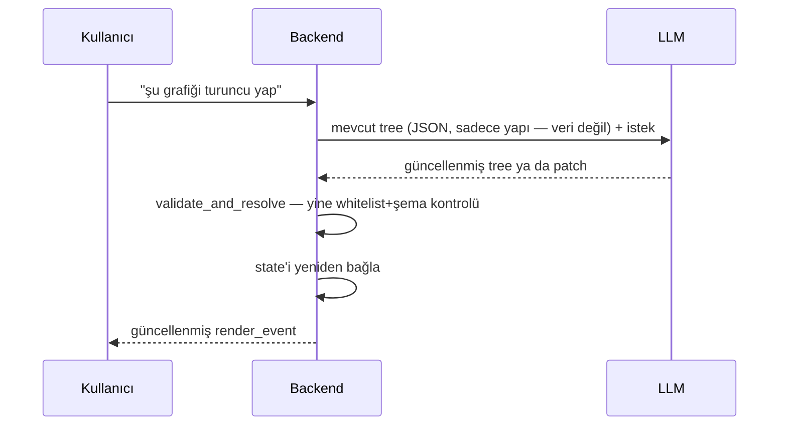

# Diyalog ile Revizyon — Var Olan Ağacı Düzenlemek

[UI Ağacı](/ai/ui-tree)'ndaki `UINode` ağacı bir kere üretilip bırakılan bir şey değil — kullanıcı "şu grafiği turuncu yap", "tabloyu en alta al" gibi bir düzenleme isteyebilir. Bu sayfa bunun mekanizmasını ve gerçek gecikme profilini anlatıyor.

## Mekanizma — mevcut ağaç LLM'e context olarak geri verilir

Kritik nokta: LLM'e giden `tree` her zaman **sadece yapı**, gerçek veri değil — [Neden LLM'e Ham Veri Vermiyoruz](/ai/why-no-raw-data) ilkesi revizyonda da aynen geçerli. Kalıcı dashboard'larda (`user_dashboards.tree`, bkz. [Dinamik UI'ın Kalıcılığı](/ai/ui-persistence)) bu bir `UPDATE` — `updated_at` bump edilir, `$state` referansları yine her açılışta taze çözülür.

## İki yaklaşım — tam yeniden üretim vs patch

| | Tam ağaç yeniden üretimi | Patch (diff) |
|---|---|---|
| LLM ne üretiyor | Değişiklik uygulanmış **tüm** ağaç | Sadece değişen yol + alan: `{"path": "tree.children[1]", "encoding.color": "orange"}` |
| Doğrulama maliyeti | Her seferinde tüm ağaç `validate_and_resolve`'dan geçer | Sadece patch hedefi doğrulanır |
| Token maliyeti | Büyük dashboard'larda yüksek | Düşük |
| Implementasyon | Basit — mevcut `validate_and_resolve` yeterli | Ayrı bir patch şeması + validasyon katmanı gerekir (henüz yok) |

MVP için tam yeniden üretim yeterli — patch, büyük/karmaşık dashboard'larda token maliyeti gerçek bir sorun olduğunda değerlendirilecek bir sonraki adım (aynı [Konuşma Bağlamı](/ai/conversation-context)'ndaki "özet MVP'de yok" kararıyla aynı mantık: veri kullanımı gerekliliği gösterirse eklenir).

## Gerçek gecikme profili — "anlık" değil, "akan"

Revizyon **anlık (instant) değil** — her istek yeni bir LLM çağrısı demek, bu 1-2 saniyelik bir tur. [Sorgu Pipeline'ı](/ai/query-pipeline)'ndaki "anlık" hissi, LLM'in cevabı tamamlanmadan her `render_event`'in SSE ile tek tek client'a akması (streaming) — gerçek round-trip gecikmesini gizlemiyor, sadece boş ekran yerine dolan bir ekran gösteriyor.

### Gerçek zamanlı (canlı sürükle-bırak) istenen yerlerde: LLM'e hiç gitme

Bir renk slider'ı sürüklerken anlık önizleme gibi gerçek "live" bir deneyim isteniyorsa, bu mimari onu **vermez** — her piksel değişikliği için LLM turu beklemek pratik değil. Çözüm, [Görsel Primitive'ler](/ai/visual-primitives)'deki inert-veri ayrımıyla aynı mantık: zaten whitelist'li, sabit seçenekli basit düzenlemeler (renk, boyut, sıralama) **client-side**, LLM'e hiç sormadan yapılır — LLM'e gitmesi gereken tek şey **yeni veri/yeni kırılım** gerektiren değişiklikler (ör. "geçen çeyrekle karşılaştır").

## Özet

- Revizyon = mevcut `tree` + istek, LLM'e geri gönderilir, aynı whitelist/şema doğrulamasından geçer — yeni bir güvenlik modeli gerekmez
- MVP: tam ağaç yeniden üretimi; patch, ölçek ihtiyacı gösterince eklenir
- Gecikme gerçek — round-trip LLM çağrısı, streaming bunu gizler ama sıfırlamaz
- Gerçek "live" deneyim isteniyorsa, LLM'e hiç gitmeyen client-side düzenleme yolu ayrıca gerekir
