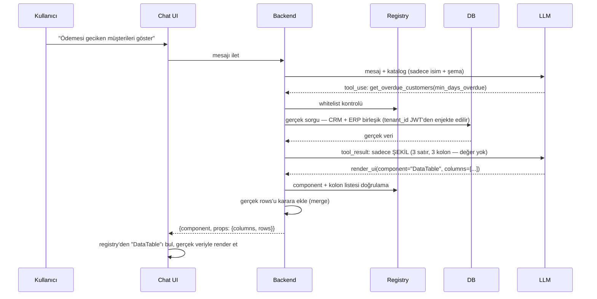

import AiCatalogBoxes from '@site/src/components/AiCatalogBoxes';
import AiFlowPipeline from '@site/src/components/AiFlowPipeline';
import CodeEditor from '@site/src/components/CodeEditor';
import CodeRail from '@site/src/components/CodeRail';

# Akış

Bu sayfa tek bir somut örnek üzerinden gidiyor: kullanıcı "**Ödemesi geciken müşterileri göster**" yazıyor. Bu örneği bilerek CRM (müşteri) ve ERP (tahsilat/cari) verisini birlikte gerektiren bir soru olarak seçtik — NewPortal'ın AI katmanının asıl değeri, tek başına bir modülde değil, modüller arası birleşik sorgularda ortaya çıkıyor. Aşağıdaki diyagram, mesajın uçtan uca hangi bileşenler arasında hangi sırayla dolaştığını **tek bakışta** gösteriyor. Burada tek bir sabit fonksiyon (`get_overdue_customers`) üzerinden basitleştirilmiş anlatılıyor — mini LLM'in niyet tespiti, ana LLM'in SQL üretmesi ve client'ın anlık render etmesi dahil tam pipeline için bkz. [Sorgu Pipeline'ı](/ai/query-pipeline).

## Adım adım

1. **Kullanıcı mesajı** — Chat UI, mesajı backend'e iletir
2. **LLM'e katalog gönderilir** — sadece isim + açıklama + şema; endpoint, DB bağlantısı, secret, gerçek veri hiçbir zaman gitmez
3. **LLM tool seçer** — native tool calling ile yapılandırılmış bir `tool_use` döner (serbest metin değil)
4. **Backend whitelist kontrolü yapar** — dönen isim `TOOL_REGISTRY`'de yoksa çağrı reddedilir
5. **Gerçek fonksiyon çalışır** — yetki/`tenant_id` kontrolü burada, JWT'den, LLM'in kararından bağımsız
6. **Sonucun ŞEKLİ LLM'e döner** — kaç satır, hangi kolonlar; gerçek değerler değil
7. **LLM component seçer** — `render_ui(component, columns)`, satır verisi bu kararda hiç yok
8. **İkinci whitelist kontrolü** — component ismi ve kolon listesi doğrulanır
9. **Backend gerçek veriyi ekler** — adım 6'da zaten elindeki DB sonucunu LLM'in kararına birleştirir
10. **Frontend registry'den render eder** — LLM'in yazdığı hiçbir markup DOM'a doğrudan basılmaz

## Neden iki ayrı whitelist kontrolü var (adım 4 ve 8)

Tool çağrısı ve UI seçimi ayrı kararlardır, ayrı ayrı doğrulanır — LLM ilk adımda whitelist'i atlatsa bile backend adım 4'te reddeder; ikinci adımda geçerli bir tool sonucunu geçersiz bir component ile eşleştirmeye çalışırsa adım 8 reddeder. Tek bir kontrol noktasına güvenmemek, saldırı yüzeyini daraltır.

:::info LLM ekrana hiçbir kod göndermeden nasıl basıyor

LLM'in gönderdiği tek şey adım 7'deki birkaç baytlık JSON: `{"component": "DataTable", "columns": [...]}` — sadece bir **isim** ve **şekil**, satır verisi yok. `DataTable`'ın gerçek React kodu LLM'e hiç sorulmadan, ürün derlenirken zaten frontend'e gömülmüş durumda (bkz. [Katalog / Registry](/ai/registry)). LLM çalışma anında sadece "önceden var olan seçeneklerden hangisi" diye işaretliyor — yeni bir component icat etmiyor, yazmıyor.

:::

## Bağlı akış: kaynaklardan sonuca

İleri/geri gezilen bir carousel değil — Tool Catalog ve UI Catalog'un Backend'e, Backend'in LLM'e nasıl bağlı olduğu ve her turdaki **gerçek giden/gelen JSON**'lar, tek kaydırmada, yukarıdan aşağıya:

<AiFlowPipeline />

## LLM'in kararıyla gerçek veriyi nasıl birleştiriyoruz

Yukarıdaki pipeline'ın son adımında "Backend gerçek veriyi ekler" yazıyor — bunun gerçek kodu şu:

<CodeRail>
  <CodeEditor
    filename="services/render_service.py"
    code={`def build_render_event(llm_decision: dict, real_rows: list[dict]) -> dict:
    # llm_decision = {"component": "DataTable", "columns": ["Müşteri", "Gecikme (gün)", "Risk Tutarı"]}
    # LLM'in kararında "rows" hiç yok — şema buna izin vermiyor (bkz. JSON Schema)
    return {
        "component": llm_decision["component"],
        "props": {
            "columns": llm_decision["columns"],
            "rows": real_rows,  # LLM'in hiç görmediği, DB'den gelen gerçek satırlar
        },
    }`}
  />
</CodeRail>

`real_rows`, adım 5'te (whitelist + gerçek sorgu) zaten backend'in elinde — LLM'e hiç gönderilmedi, sadece bekletildi. Bu fonksiyonun çağrıldığı yer, akışın tamamını tek bakışta özetler:

<CodeRail>
  <CodeEditor
    filename="routers/chat.py"
    code={`# Adım 5: gerçek veri, LLM'e hiç gitmeden, doğrudan DB'den çekilir
tool_result = await run_tool("get_overdue_customers", {"min_days_overdue": 30})

# Adım 6-7: LLM'e sadece ŞEKİL gönderilir, LLM component+columns seçer
llm_decision = await ask_llm_to_choose_component(shape_of(tool_result))

# Adım 9: gerçek veri + LLM'in kararı burada birleştirilir — LLM bu adımı hiç görmez
render_event = build_render_event(llm_decision, real_rows=tool_result["rows"])

await send_to_client(render_event)  # Adım 10`}
  />
</CodeRail>

LLM'in tek katkısı `component` ve `columns` seçmek; `rows`'u LLM ne üretiyor ne de görüyor — "veriyi taşıma" işi tamamen bu iki fonksiyonun elinde, LLM'in konuşma geçmişine hiç girmiyor.

Katalog girdilerinin tam şeması (referans)

<AiCatalogBoxes />

