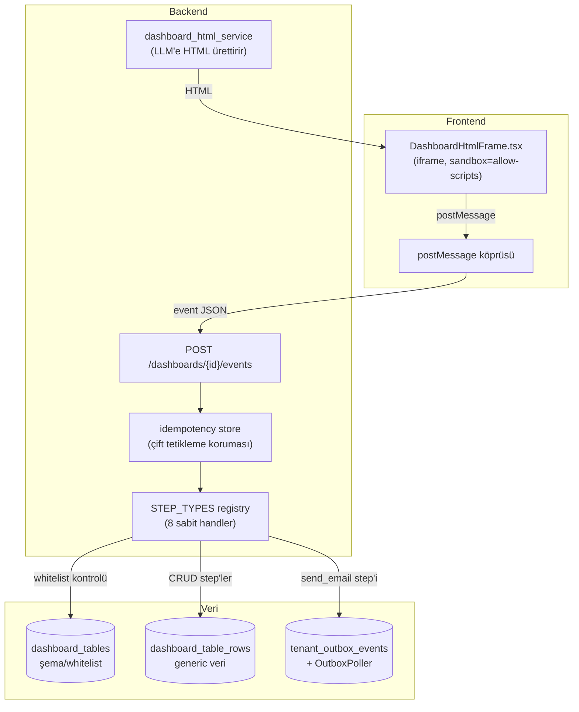

import ScrumboardDemo from '@site/src/components/ScrumboardDemo';
import EventPipelineBuilder from '@site/src/components/EventPipelineBuilder';

# Use Case: Scrum Board — v0.1 → v0.2

[Dashboard Event Kataloğu](/ai/dashboard-event-catalog)'nda anlatılan tasarımın **somut senaryosu**: kullanıcı "bana scrum board yap" dedi, LLM 3 kolonlu bir pano üretti, kullanıcı bir kartı **Bitti**'ye sürüklüyor. Aşağıdaki mockup'ı sen de sürükle — sağdaki panelde bunun **servislere ve DB'ye gerçekte ne yaptığını** adım adım gör.

- **v0.1** — ilk düşündüğümüz, saf hâl: LLM her isteği HTML olarak üretir, hiçbir şey kalıcı değil.
- **v0.2** — şu anki karar: [step pipeline](/ai/dashboard-event-catalog#katalog-2--step-pipeline-sabit-8-10-step-tipi-sınırsız-dizilim) + Mongo, kalıcı ve geri alınabilir.

<ScrumboardDemo />

## v0.1 → v0.2 arada ne değişti, bize ne kazandırdı

| | v0.1 (saf HTML) | v0.2 (step pipeline) |
|---|---|---|
| Kartı taşımanın etkisi | Sadece o sekmenin JS belleği | `POST /dashboards/{id}/events` → Mongo `dashboard_table_rows` |
| Sayfa yenilenirse | Kart eski yerine döner | Aynı kalır — Mongo'dan okunuyor |
| Yanlışlıkla yanlış kolona taşırsan | Geri almanın yolu yok | `previous` alanından tek tıkla **Geri Al** |
| Güvenlik sınırı | Yok — zaten hiçbir şeye yazmıyor | `table_id` tenant kontrolü + alan whitelist'i ([detay](/ai/dashboard-event-catalog#i̇ki-whitelist-kapısı--injectionun-gerçekte-nerede-engellendiği)) |
| Yeni bir tablo/kolon istenirse | LLM HTML'i değiştirir, backend haberdar olmaz | `dashboard_tables` şemasına eklenmesi gerekir — [açık nokta](/ai/dashboard-event-catalog#kapsam-dışı--açık-noktalar) |

**Kazandığımız şey:** kullanıcı gördüğü panoyu gerçekten "kullanabiliyor" — tıkladığı/sürüklediği şey kalıcı, güvenli, geri alınabilir. Bedeli: yeni bir step tipi bilinçli eklenmesi gereken bir karar, otomatik büyümüyor.

---

## Aynı sistem, farklı dashboard'lar, farklı istekler — builder'ın kendisi

Yukarıdaki scrumboard tek bir senaryo. Asıl soru: **kişi tamamen farklı bir pano/istek getirdiğinde aynı altyapı yetiyor mu?** Aşağıda az önce [Dashboard Event Kataloğu](/ai/dashboard-event-catalog)'nda tasarladığımız **step pipeline builder'ın** kendisi var — presetlerle 4 farklı dashboard/istek türünü yükle, adım ekle/çıkar/sırala, JSON'u canlı gör, çalıştır:

<EventPipelineBuilder />

4 preset kasıtlı olarak birbirinden çok farklı: **yazma** (sipariş onayla — çok adımlı), **koşullu tetikleme** (stok uyarısı), **okuma/arama** (müşteri arama), **hesaplama** (haftalık ciro). Hepsi aynı 8 step tipinin farklı dizilimi — hiçbiri için yeni kod yazılmadı.

## Sistemin bileşen haritası — kaç parça var

**7 bileşen, hepsi zaten var olan ya da tasarlanmış parçalar** — yeni bir "büyük" altyapı gerekmiyor: `DashboardHtmlFrame.tsx` ve `tenant_outbox_events`/`OutboxPoller` **zaten kodda var**; `POST /dashboards/{id}/events`, idempotency store, `STEP_TYPES` registry ve `dashboard_tables` henüz yazılmadı ama küçük, sınırları net parçalar (bkz. [Kapsam dışı / açık noktalar](/ai/dashboard-event-catalog#kapsam-dışı--açık-noktalar)).

## Bu mockup'lar neyi basitleştiriyor

- Gerçek akışta `postMessage` **sandboxed iframe**'den geliyor, burada doğrudan React state — mesajlaşma katmanı simüle edildi.
- Gerçekte her step Mongo'ya/outbox'a gerçekten yazıyor; burada bellek-içi simülasyon var.
- Whitelist kontrolleri burada her zaman ✅ dönüyor (mockup sabit senaryolarla çalışıyor); gerçek sistemde bunlar gerçekten reddedebilen kontroller.
- Builder'daki adım parametreleri (ör. `patch`, `filters`) burada sabit varsayılanlar — gerçek sistemde LLM bunları `dashboard_tables.columns`'a göre dolduracak.

## İlgili

- [Dashboard Event Kataloğu ve Dinamik Tablo Kataloğu](/ai/dashboard-event-catalog) — bu senaryoların arkasındaki tam tasarım
- [Diyalog ile Revizyon](/ai/dynamic-revision) — "şu grafiği turuncu yap" gibi LLM'e geri giden revizyonlar, step pipeline'dan farklı bir mekanizma
