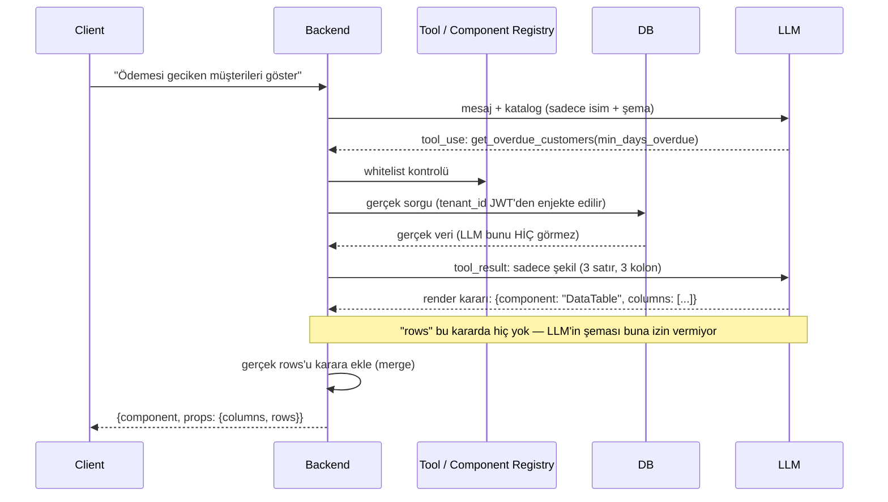

# Neden LLM'e Ham Veri/Endpoint Vermiyoruz

## Özet

- **LLM'e giden**: sadece isimler + şemalar (tool adı, tablo/kolon adı, component adı, parametre tipi). Endpoint yok, veri yok.
- **LLM'den dönen**: düz metin değil, yapılandırılmış JSON (`tool_use`) — "şu ismi, şu parametrelerle çağır" ya da "şu component'i, şu kolonlarla göster" diyor.
- **Backend'de olan**: dönen isim `TOOL_REGISTRY`'de var mı diye bakılır → varsa, LLM'in hiç görmediği gerçek fonksiyon (gerçek endpoint/DB sorgusu, `tenant_id` JWT'den) çalışır → gerçek veri backend'de kalır, LLM'e geri gönderilmez (sadece şekli/tipi gönderilir, değeri değil).
- **UI için**: LLM ikinci kez çağrılır ama ona da veri değil, "kaç kolon var, tipi ne" gibi meta bilgi verilir; o da `{"component": "DataTable", "columns": [...]}` gibi bir JSON döner — `rows` bu JSON'da hiç yoktur.
- **Ekranda olan**: backend, LLM'in kararına gerçek veriyi ekleyip client'a gönderir; frontend'deki component registry ismi gerçek React component'ine eşler, gerçek veriyi (backend'den doğrudan gelen) ona basar.

**Tek cümle:** LLM hep isim ve şekil seçer, biz her seçimi kendi sözlüğümüzde arayıp gerçek kodu biz çalıştırırız — veri, LLM'in konuşma geçmişinden hiç geçmeden, backend'den doğrudan component'e akar.

## Diyagram



Bu diyagramın bağlı, her turdaki gerçek giden/gelen JSON'ları gösteren hâli için bkz. [Akış](/ai/flow) — orada aynı senaryo, kaynaklardan (Tool/UI Catalog) ekrandaki nihai render'a kadar tek kaydırmada gösteriliyor.

## Kod örneği

Bu akışı native tool calling ile (metinde rica etmek yerine, API seviyesinde şema zorlayarak) nasıl kurduğumuzun tam örneği [Katalog / Registry](/ai/registry#katalogdan-native-tool-schemaya) sayfasında — `tool_choice` zorlaması ve `input_schema` kısıtının neden bir güvenlik katmanı olduğu orada satır satır açıklanıyor.

## JSON Schema referansı

Yukarıdaki dört sözleşme (`catalogEntry`, `toolUseEvent`, `llmRenderDecision`, `renderEvent`) resmi JSON Schema olarak tanımlı: [`ai-catalog.schema.json`](/schemas/ai-catalog.schema.json). Hepsinde `additionalProperties: false` var — yani whitelist mantığı sadece anlatılmıyor, şemada da zorlanıyor: `llmRenderDecision` şemasında `rows`/`value` alanı **hiç tanımlı değil**, LLM bunu üretmeye çalışsa bile şema doğrulamasından geçemez.

```json title="llmRenderDecision (özet)" showLineNumbers
{
  "additionalProperties": false,
  "required": ["component"],
  "properties": {
    "component": { "type": "string" },
    "columns": { "type": "array", "items": { "type": "string" } }
  }
}
```

Tam şema için bkz. [Katalog / Registry](/ai/registry) ve [Güvenlik Modeli](/ai/security-model).
