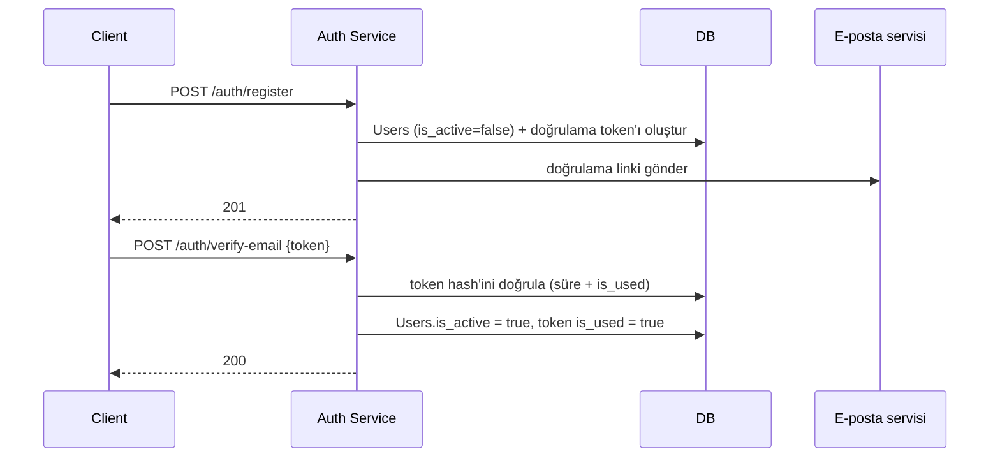

# E-posta Doğrulama

`/auth/register` sonrası hesap `is_active = false` ile oluşturulur; doğrulama tamamlanana kadar login engellenir.

## Akış

## Notlar

- Doğrulama token'ı da [Token Design](/services/auth-service/token-design)'daki gibi random + hash üretilir, TTL 24 saat
- `is_active = false` durumundaki hesap `/auth/login`'de `AuthenticationError` (401) alır — token süresi dolduysa yeni doğrulama e-postası isteme (`/auth/resend-verification`) ile çözülür
- E-posta gönderimi senkron HTTP döngüsünde yapılmaz, async kuyruğa (BullMQ/Celery benzeri) bırakılır — kullanıcı e-posta servisinin yavaşlığını beklemez
