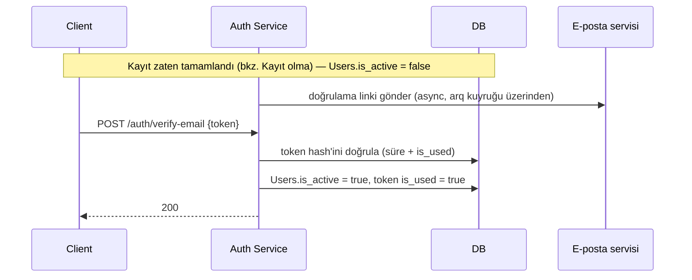

# E-posta Doğrulama

[Kayıt olma](/use-cases/user-registration) sonrası hesap `is_active = false` ile oluşturulur; doğrulama tamamlanana kadar login engellenir. Bu sayfa sadece doğrulama adımını anlatır — kayıt isteğinin kendisi için bkz. [Kayıt olma](/use-cases/user-registration).

## Akış

## Notlar

- Doğrulama token'ı da [Token Design](/services/auth-service/token-design)'daki gibi random + hash üretilir, TTL 24 saat
- `is_active = false` durumundaki hesap `/auth/login`'de `AuthenticationError` (401) alır — token süresi dolduysa yeni doğrulama e-postası isteme (`/auth/resend-verification`) ile çözülür
- E-posta gönderimi senkron HTTP döngüsünde yapılmaz, [arq](/guides/libraries) kuyruğuna bırakılır — kullanıcı e-posta servisinin yavaşlığını beklemez
