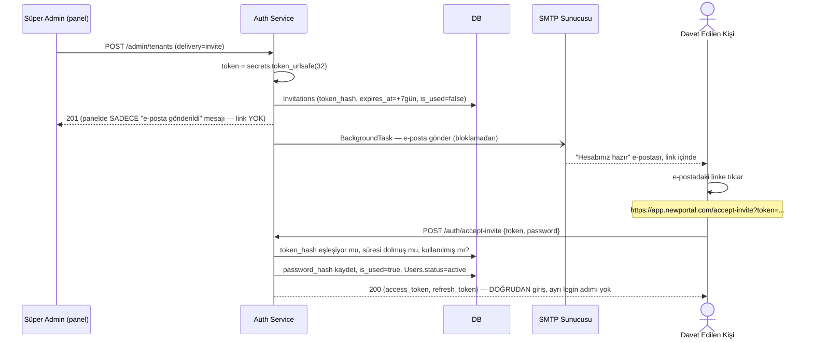

import CodeEditor from '@site/src/components/CodeEditor';
import CodeRail from '@site/src/components/CodeRail';

# Davet Linki Teslimi

[Tenant Oluşturma](/use-cases/user-registration) ve [Ekip Daveti](/use-cases/team-invitation) sayfaları "davet e-postası gönderilir" diyor — bu sayfa **nasıl** gönderildiğini anlatıyor. Kritik nokta: link **süper admin panelinde bir yerde durup kopyalanmıyor** — panel sadece tetikliyor, gerçek teslimat backend'den **doğrudan alıcının kendi e-posta kutusuna** e-posta olarak gidiyor. Büyük firmaların (Auth0, WorkOS, Slack) hepsi aynı deseni kullanıyor: transactional e-posta, panelde gösterilen bir "linki kopyala" butonu değil.

## Uçtan uca — kim neyi tetikliyor



## Token — JWT değil, ayrı bir opak secret

Access/refresh token'lardan (JWT) tamamen farklı bir mekanizma: yüksek entropili rastgele bir string, DB'ye **hash'lenmiş** hâliyle yazılır — ham token hiçbir yerde (DB, log) durmaz, sadece e-postadaki linkte var.

<CodeRail>
  <CodeEditor
    filename="services/invitations.py"
    code={`import hashlib
import secrets
from datetime import datetime, timedelta

def create_invitation(user_id: str) -> str:
    raw_token = secrets.token_urlsafe(32)          # linke giden, sadece bir kez görünen değer
    token_hash = hashlib.sha256(raw_token.encode()).hexdigest()

    db.invitations.insert({
        "user_id": user_id,
        "token_hash": token_hash,                   # DB'de SADECE hash duruyor
        "expires_at": datetime.utcnow() + timedelta(days=7),
        "is_used": False,
    })
    return raw_token  # bu değer sadece e-posta gönderiminde kullanılır, DB'ye hiç yazılmaz`}
  />
</CodeRail>

## E-posta gönderimi — SMTP, `.env`'den, isteği bloklamadan

<CodeRail>
  <CodeEditor
    filename="services/email_service.py"
    code={`import aiosmtplib
from email.message import EmailMessage
from core.settings import get_settings

async def send_invite_email(to_email: str, raw_token: str) -> None:
    settings = get_settings()
    link = f"{settings.frontend_url}/accept-invite?token={raw_token}"

    msg = EmailMessage()
    msg["From"] = f"{settings.email_from_name} <{settings.email_from_address}>"
    msg["To"] = to_email
    msg["Subject"] = "NewPortal hesabınız hazır"
    msg.set_content(f"Hesabınızı aktifleştirmek için: {link}")

    await aiosmtplib.send(
        msg,
        hostname=settings.smtp_host,
        port=settings.smtp_port,
        username=settings.smtp_user,
        password=settings.smtp_password,
        start_tls=True,
    )`}
  />
</CodeRail>

<CodeRail>
  <CodeEditor
    filename="routers/admin.py"
    code={`@router.post("/admin/tenants")
async def create_tenant(payload: CreateTenantRequest, background_tasks: BackgroundTasks, ...):
    tenant, admin_user = await create_tenant_and_admin(payload)          # kritik, atomic (Postgres)
    raw_token = create_invitation(admin_user.id)

    # E-posta gönderimi ARKA PLANDA — isteği bloklamaz, kritik değil (retry'lanabilir)
    background_tasks.add_task(send_invite_email, admin_user.email, raw_token)

    return {"tenant_id": tenant.id, "user_id": admin_user.id, "message_code": "admin.tenant.invite_sent"}
    # Dikkat: response'ta raw_token/link YOK — sadece e-postaya gidiyor`}
  />
</CodeRail>

`core/settings.py`'ye eklenmesi gereken alanlar — [`jwt_secret`](/services/auth-service/token-design) ile aynı desende, `.env`'den okunuyor:

```
SMTP_HOST=...
SMTP_PORT=587
SMTP_USER=...
SMTP_PASSWORD=...
EMAIL_FROM_ADDRESS=...
EMAIL_FROM_NAME=...
FRONTEND_URL=https://app.newportal.com
```

Firma projeyi teslim aldığında sadece `.env`'i değiştirir — kod hiçbir vendor'a (SES/SendGrid) kilitlenmez, SMTP protokolü üzerinden hangi sağlayıcıyı isterlerse onu takarlar.

## Link nereye gidiyor — admin paneline değil, ürünün kendi frontend'ine

`https://app.newportal.com/accept-invite?token=...` — **süper admin paneli değil**, gerçek ürünün frontend'i. Orada bir "şifreni belirle" sayfası, token URL'den okunur, submit'te `POST /auth/accept-invite` çağrılır. Süper admin panelinde link hiç görünmez, hiç kopyalanmaz — sadece "gönderildi" onayı görünür (bkz. yukarıdaki sequence diagram, adım 4).

## `accept-invite` neden direkt giriş de yapıyor

Kullanıcı token ile e-posta sahipliğini zaten kanıtladı — şifre belirledikten sonra ayrıca [Login](/use-cases/login-and-token-issuance) ekranına düşürülmüyor, `accept-invite`'ın kendisi `access_token` + `refresh_token` döndürüyor (login ile aynı response şekli). Link → şifre → doğrudan ürünün içi.

## Domain kararı — tek paylaşımlı domain, subdomain routing değil (şimdilik)

`Tenants.subdomain` alanı var ama bunu URL routing için kullanmıyoruz (`akgun-ticaret.newportal.com` gibi) — wildcard SSL, DNS, tenant-resolve middleware gibi gerçek altyapı yükü getirir. MVP'de tek domain (`app.newportal.com`) yeterli; tenant zaten JWT'den çözülüyor, URL'den değil. `subdomain` şimdilik sadece bir tanımlayıcı.

## İlgili sayfalar

- [Tenant Oluşturma](/use-cases/user-registration) — bu mekanizmayı tetikleyen ilk yer
- [Ekip Daveti](/use-cases/team-invitation) — aynı `accept-invite`'ı kullanan ikinci yer
- [Token Design](/services/auth-service/token-design) — access/refresh token'ların (bu sayfadaki davet token'ından farklı) nasıl üretildiği
