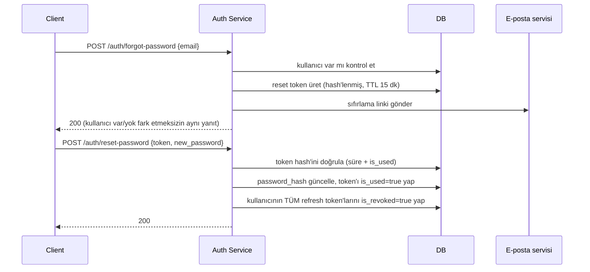

import ApiExample from '@site/src/components/ApiExample';
import CodeEditor from '@site/src/components/CodeEditor';
import CodeRail from '@site/src/components/CodeRail';

<CodeRail>
  <ApiExample
    method="POST"
    path="/auth/forgot-password"
    request={{ email: 'ayse@firma.com' }}
    response={{ message_code: 'auth.forgot_password.email_sent' }}
  />
</CodeRail>

# Şifre Sıfırlama

Kullanıcı e-postasını gönderir. Yanıt, e-posta kayıtlı olsa da olmasa da **aynıdır** — bkz. [Notlar](#notlar). Dikkat: yanıt sabit bir Türkçe metin değil, bir **i18n kodu** — frontend bunu kullanıcının diline çevirir (bkz. [coding-standards](/guides/coding-standards#i18n--backend-asla-nihai-dilde-metin-döndürmez)).

<CodeRail>
  <ApiExample
    method="POST"
    path="/auth/reset-password"
    request={{ token: 'r7t2k...9zqm', new_password: '••••••••' }}
    response={{ message_code: 'auth.reset_password.success' }}
  />
</CodeRail>

Client, e-postadaki token'ı ve yeni şifreyi gönderir. Başarılıysa şifre güncellenir ve kullanıcının tüm refresh token'ları iptal edilir.

## Akış

## Üretim

<CodeRail>
  <CodeEditor
    filename="services/token_service.py"
    code={`PASSWORD_RESET_TTL_MINUTES = 15

async def issue_password_reset_token(db, user_id: str) -> str:
    # aynı üretim şekli: random + hash (bkz. Token Design)
    raw_token, token_hash = create_refresh_token()
    await db.execute(
        insert(PasswordResetTokens).values(
            user_id=user_id,
            token_hash=token_hash,
            expires_at=datetime.now(timezone.utc) + timedelta(minutes=PASSWORD_RESET_TTL_MINUTES),
            is_used=False,
        )
    )
    return raw_token`}
  />
</CodeRail>

## Notlar

- `/auth/forgot-password` her zaman `200` döner — kullanıcı DB'de olsa da olmasa da. Aksi hâlde yanıt farkından hangi e-postaların kayıtlı olduğu (user enumeration) anlaşılabilir.
- Reset token tek kullanımlıktır (`is_used`), refresh token gibi rotasyona değil **tek seferlik tüketime** göre tasarlanır — TTL de kısa (15 dk), refresh token'ın 30 gününden farklı.
- Şifre değiştiğinde kullanıcının tüm refresh token'ları iptal edilir — hesap ele geçirilmişse, şifre sıfırlanınca saldırganın elindeki refresh token de geçersiz kalır.
