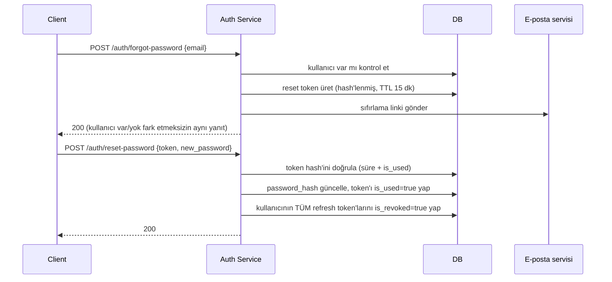

# Şifre Sıfırlama

## Akış



## Üretim

```python
# services/token_service.py
PASSWORD_RESET_TTL_MINUTES = 15


async def issue_password_reset_token(db, user_id: str) -> str:
    raw_token, token_hash = create_refresh_token()  # aynı üretim şekli: random + hash
    await db.execute(
        insert(PasswordResetTokens).values(
            user_id=user_id,
            token_hash=token_hash,
            expires_at=datetime.now(timezone.utc) + timedelta(minutes=PASSWORD_RESET_TTL_MINUTES),
            is_used=False,
        )
    )
    return raw_token
```

## Notlar

- `/auth/forgot-password` her zaman `200` döner — kullanıcı DB'de olsa da olmasa da. Aksi hâlde yanıt farkından hangi e-postaların kayıtlı olduğu (user enumeration) anlaşılabilir.
- Reset token tek kullanımlıktır (`is_used`), refresh token gibi rotasyona değil **tek seferlik tüketime** göre tasarlanır — TTL de kısa (15 dk), refresh token'ın 30 gününden farklı.
- Şifre değiştiğinde kullanıcının tüm refresh token'ları iptal edilir — hesap ele geçirilmişse, şifre sıfırlanınca saldırganın elindeki refresh token de geçersiz kalır.
