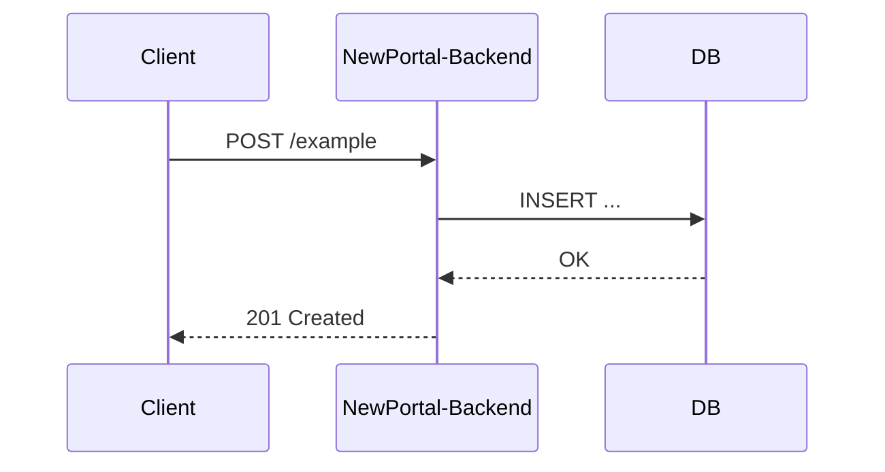

# Kullanım Senaryoları

NewPortal bir B2B SaaS — sistemde "bireysel kullanıcı" yoktur, her kullanıcı bir **tenant**'a (şirket) bağlıdır. Auth ile ilgili sayfalar iki bölüme yayılmış durumda: buradaki sayfalar **akışı** (ne, hangi sırayla olur) anlatır; [Servisler](/services) altındakiler **referans** detayını (endpoint, kod) tutar. Tek ekranda, uçtan uca görmek için bkz. [Uçtan Uca — Firma Nasıl Sisteme Girer](/use-cases/onboarding-journey). Yeni birinin sistemi baştan sona anlaması için önerilen okuma sırası:

1. [Tenant Oluşturma](/use-cases/user-registration) — **süper admin**, tenant + ilk admin'i birlikte oluşturur (self-servis kayıt yok)
2. [Login ve token oluşturma](/use-cases/login-and-token-issuance) — access/refresh token nasıl alınır
3. [Ekip Daveti](/use-cases/team-invitation) — admin, aynı tenant'a başka kullanıcı nasıl ekler — ilk admin'in davet/geçici şifre akışıyla **aynı** mekanizma
4. [Profil](/services/auth-service/profile) — token'la korumalı bir endpoint'e ilk erişim örneği
5. [Şifre Sıfırlama](/services/auth-service/password-reset) — sıralı akışın parçası değil, ihtiyaç anında devreye giren ayrı bir dal

Token'ın kendisinin (access/refresh, rotasyon) nasıl üretildiği bu sayfaların hiçbirinde tekrar anlatılmaz — hepsi [Token Design](/services/auth-service/token-design)'a link verir, tek doğruluk kaynağı orasıdır. Tenant/DB izolasyonunun genel stratejisi (shared-schema + `tenant_id`, migration'ların tek sette uygulanması) için bkz. [Multi-tenancy](/guides/multi-tenancy).

## Yeni bir senaryo eklerken

Her uçtan uca senaryo için burada ayrı bir sayfa açılır (`docs/use-cases/<senaryo-adı>.mdx`). Şablon:

````markdown
# <Senaryo Adı>

## Tanım
Senaryo ne için var, aktörler kim (kullanıcı, sistem, 3. parti).

## Akış



## Adımlar
1. ...

## Hata / edge-case senaryoları
- ...
````

Diyagram resim olarak eklenmez, Mermaid kod bloğu olarak yazılır — böylece PR review'da diff görünür ve versiyonlanır.
