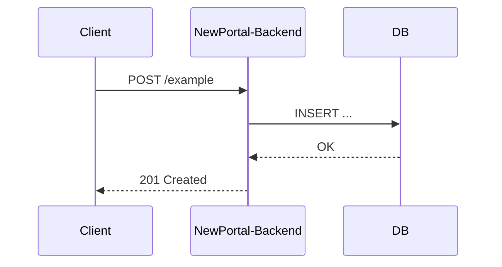

# Kullanım Senaryoları

Her uçtan uca senaryo için burada ayrı bir sayfa açılır (`docs/use-cases/<senaryo-adı>.mdx`). İlk senaryo (ör. `user-registration`) eklendiğinde şu şablonu kullanın:

## Şablon

````markdown
# <Senaryo Adı>

## Tanım
Senaryo ne için var, aktörler kim (kullanıcı, sistem, 3. parti).

## Akış



## Adımlar
1. ...

## Hata / edge-case senaryoları
- ...
````

Diyagram resim olarak eklenmez, Mermaid kod bloğu olarak yazılır — böylece PR review'da diff görünür ve versiyonlanır.
