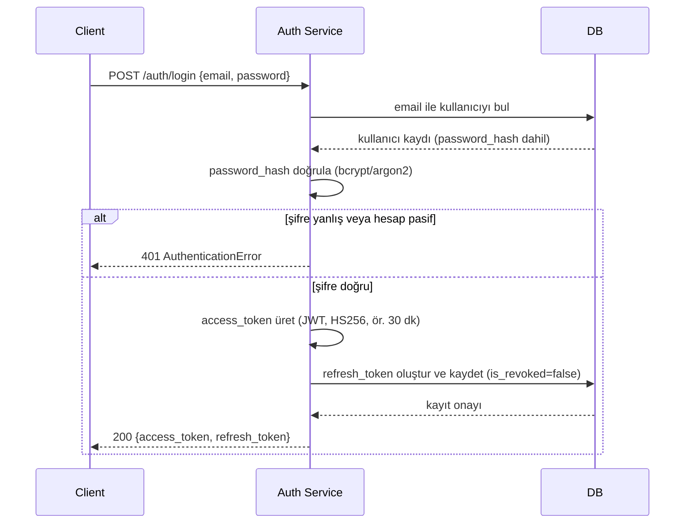

import ApiExample from '@site/src/components/ApiExample';

# Login ve token oluşturma

<ApiExample
  method="POST"
  path="/auth/login"
  request={{ email: 'ayse@firma.com', password: '••••••••' }}
  response={{
    access_token: 'eyJhbGciOiJIUzI1NiIs...',
    refresh_token: 'k3f9x...s0p2q',
    token_type: 'bearer',
  }}
>

## Tanım

Kullanıcı, e-posta ve şifresiyle giriş yapar; başarılı olursa kısa ömürlü bir **access token** (korumalı endpoint'lere erişim için) ve uzun ömürlü bir **refresh token** (access token süresi dolunca yenilemek için) alır. Aktörler: Client (frontend), Auth Service, DB.

</ApiExample>

## Akış

## Adımlar

1. **Client** `/auth/login`'e `email` ve `password` gönderir
2. **Auth Service**, `email` ile `Users` tablosunda kaydı arar
3. Kayıt bulunamazsa veya `is_active = false` ise `AuthenticationError` (401) döner — "kullanıcı yok" ile "şifre yanlış" **aynı** hata mesajıyla döner (bkz. Güvenlik notu)
4. Kayıt bulunduysa, gönderilen şifre `password_hash` ile karşılaştırılır (bcrypt/argon2 — düz metin şifre asla DB'de tutulmaz)
5. Şifre yanlışsa yine `AuthenticationError` (401)
6. Şifre doğruysa: kısa ömürlü bir **access token** (JWT, `core/settings.py`'deki `jwt_secret`/`jwt_algorithm` ile imzalanır, `access_token_expire_minutes` sonra geçersiz olur) üretilir
7. Bir **refresh token** üretilir ve `RefreshTokens` tablosuna `user_id`, `expires_at`, `is_revoked=false` ile kaydedilir
8. Her ikisi de `200 OK` ile client'a döner; client bunları güvenli şekilde saklar (ör. `httpOnly` cookie veya secure storage — düz `localStorage` önerilmez)

### Token yenileme (`/auth/refresh`)

Access token süresi dolunca client, refresh token'ı `/auth/refresh`'e gönderir. Geçerliyse hem yeni bir access token hem yeni bir refresh token döner, eski refresh token `is_revoked = true` yapılır (rotasyon) — üretim/doğrulama kodu ve rotasyonun gerekçesi için bkz. [Token Design](/services/auth-service/token-design).

### Çıkış (`/auth/logout`)

Client `/auth/logout`'a refresh token'ı gönderir, Auth Service ilgili kaydı `is_revoked = true` yapar. Access token DB'de tutulmadığı için "hemen iptal" edilemez — süresi dolana kadar teknik olarak geçerli kalır; bu yüzden `access_token_expire_minutes` kısa tutulur.

## Hata / edge-case senaryoları

| Senaryo | Sonuç |
|---|---|
| E-posta yok veya şifre yanlış | 401, **aynı** genel mesaj ("e-posta veya şifre hatalı") — hangisinin yanlış olduğu client'a söylenmez |
| Hesap `is_active = false` | 401 — devre dışı bırakılmış hesap, var olduğu belli edilmeden reddedilir |
| Refresh token süresi dolmuş | 401 — client yeniden `/auth/login` yapmak zorunda kalır |
| Refresh token `is_revoked = true` | 401 — daha önce logout olmuş veya iptal edilmiş bir token tekrar kullanılamaz |

## Güvenlik notu

Adım 3 ve 5'te "kullanıcı yok" ile "şifre yanlış" durumlarının aynı hata mesajını dönmesi kasıtlıdır — aksi hâlde bir saldırgan, hangi e-postaların sistemde kayıtlı olduğunu deneme-yanılma ile (user enumeration) öğrenebilir.
