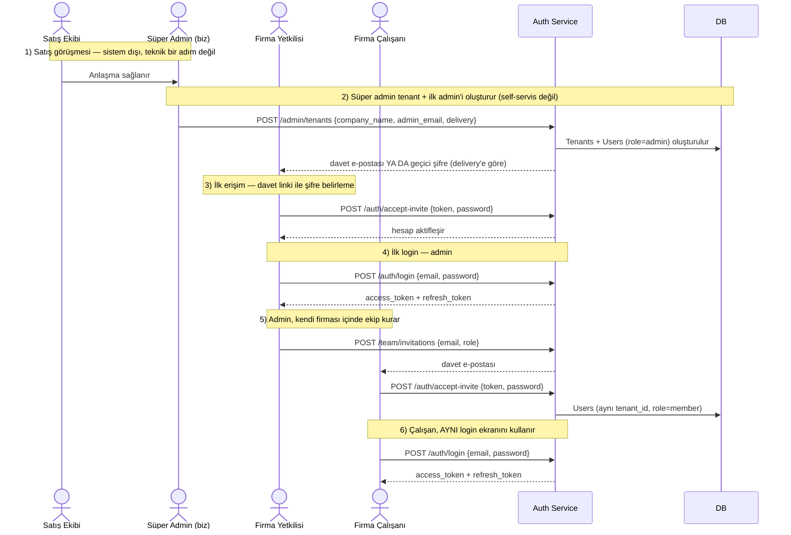

import CodeRail from '@site/src/components/CodeRail';

# Uçtan Uca — Firma Nasıl Sisteme Girer

Aşağıdaki sayfaların ([Kayıt olma](/use-cases/user-registration), [Login](/use-cases/login-and-token-issuance), [Ekip Daveti](/use-cases/team-invitation)) her biri kendi detayını (endpoint, hata kodları, güvenlik notu) anlatıyor. Bu sayfa onları **tek bir hikaye** olarak, gerçek iş sırasıyla birleştiriyor — sunumda tek ekranda gösterilecek olan bu.

## Tek bakışta akış

## Adım adım — kim, ne zaman, hangi endpoint

| # | Adım | Kim tetikler | Endpoint | Detay |
|---|---|---|---|---|
| 1 | Satış görüşmesi | Satış ekibi | — (sistem dışı) | — |
| 2 | Tenant + ilk admin oluşturulur | **Süper admin** (firma yetkilisi değil) | `POST /admin/tenants` | [Tenant Oluşturma](/use-cases/user-registration) |
| 3 | İlk erişim — şifre belirleme | Firma yetkilisi | `POST /auth/accept-invite` (`delivery="invite"` ise) | [Tenant Oluşturma](/use-cases/user-registration) |
| 4 | İlk login (admin) | Firma yetkilisi | `POST /auth/login` | [Login ve token oluşturma](/use-cases/login-and-token-issuance) |
| 5 | Ekip daveti | Admin | `POST /team/invitations` → `POST /auth/accept-invite` | [Ekip Daveti](/use-cases/team-invitation) |
| 6 | Çalışan login | Firma çalışanı | `POST /auth/login` (adım 4 ile **aynı** endpoint) | [Login ve token oluşturma](/use-cases/login-and-token-issuance) |

## Kritik noktalar

- **Tek login ekranı, iki farklı köken:** Adım 4 ve adım 6, **aynı** `POST /auth/login` endpoint'ini çağırıyor — sistem, bir kullanıcının "ilk admin mi yoksa sonradan davet edilen mi" olduğunu login anında hiç ayırt etmiyor, ayrım sadece `Users.role` alanında duruyor.
- **Tek davet mekanizması, iki tetikleyici:** Adım 3 ve adım 5'teki `POST /auth/accept-invite` **aynı kod yolu** — farkı sadece kimin daveti gönderdiği (süper admin vs. tenant admin'i). Ayrı bir "self-servis register" akışı bakımda tutulmuyor.

## Kapsam dışı (bilinçli sınır)

- **Bir kullanıcı = bir firma, bir departman.** Aynı e-posta ile iki farklı tenant'a üye olma, ya da bir kullanıcının birden fazla departmanda görünmesi şu an desteklenmiyor — ihtiyaç netleşirse ayrı bir karar/şema değişikliği olarak ele alınır.
- **Satış görüşmesi sistemin bir parçası değil** — CRM'de ayrı bir kayıt olabilir ama Auth Service'in hiçbir endpoint'i bu adımı bilmez; hikaye sadece bağlamı netleştirmek için burada.
