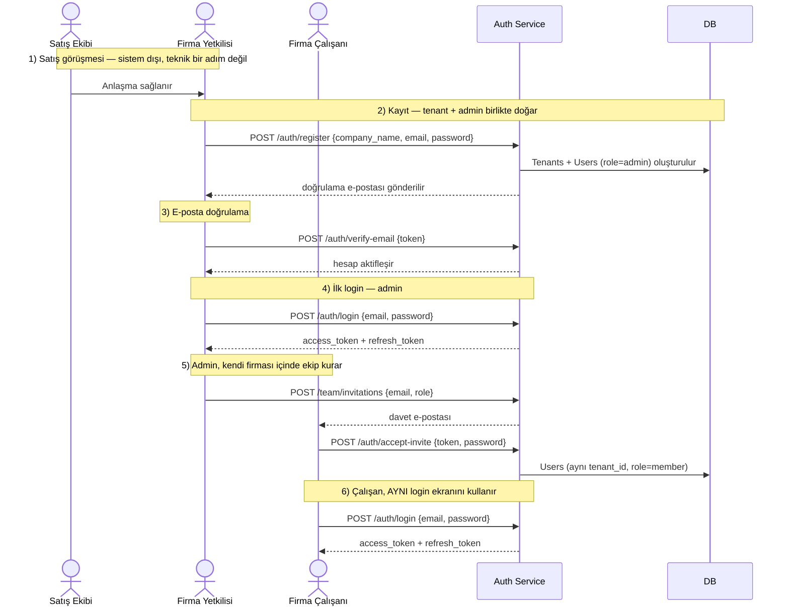

import CodeRail from '@site/src/components/CodeRail';

# Uçtan Uca — Firma Nasıl Sisteme Girer

Aşağıdaki sayfaların ([Kayıt olma](/use-cases/user-registration), [Login](/use-cases/login-and-token-issuance), [Ekip Daveti](/use-cases/team-invitation)) her biri kendi detayını (endpoint, hata kodları, güvenlik notu) anlatıyor. Bu sayfa onları **tek bir hikaye** olarak, gerçek iş sırasıyla birleştiriyor — sunumda tek ekranda gösterilecek olan bu.

## Tek bakışta akış

## Adım adım — kim, ne zaman, hangi endpoint

| # | Adım | Kim tetikler | Endpoint | Detay |
|---|---|---|---|---|
| 1 | Satış görüşmesi | Satış ekibi | — (sistem dışı) | — |
| 2 | Kayıt — tenant + admin birlikte oluşur | Firma yetkilisi | `POST /auth/register` | [Kayıt olma](/use-cases/user-registration) |
| 3 | E-posta doğrulama | Firma yetkilisi | `POST /auth/verify-email` | [E-posta Doğrulama](/services/auth-service/email-verification) |
| 4 | İlk login (admin) | Firma yetkilisi | `POST /auth/login` | [Login ve token oluşturma](/use-cases/login-and-token-issuance) |
| 5 | Ekip daveti | Admin | `POST /team/invitations` → `POST /auth/accept-invite` | [Ekip Daveti](/use-cases/team-invitation) |
| 6 | Çalışan login | Firma çalışanı | `POST /auth/login` (adım 4 ile **aynı** endpoint) | [Login ve token oluşturma](/use-cases/login-and-token-issuance) |

## Kritik nokta — tek login ekranı, iki farklı köken

Adım 4 ve adım 6, **aynı** `POST /auth/login` endpoint'ini çağırıyor — sistem, bir kullanıcının "ilk admin mi yoksa sonradan davet edilen mi" olduğunu login anında hiç ayırt etmiyor, ayrım sadece `Users.role` alanında duruyor. Bu kasıtlı: login akışını tek, basit ve tutarlı tutuyor; "nasıl üye oldun" bilgisi sadece kayıt/davet aşamasında önemli, login aşamasında değil.

## Kapsam dışı (bilinçli sınır)

- **Bir kullanıcı = bir firma, bir departman.** Aynı e-posta ile iki farklı tenant'a üye olma, ya da bir kullanıcının birden fazla departmanda görünmesi şu an desteklenmiyor — ihtiyaç netleşirse ayrı bir karar/şema değişikliği olarak ele alınır.
- **Satış görüşmesi sistemin bir parçası değil** — CRM'de ayrı bir kayıt olabilir ama Auth Service'in hiçbir endpoint'i bu adımı bilmez; hikaye sadece bağlamı netleştirmek için burada.
