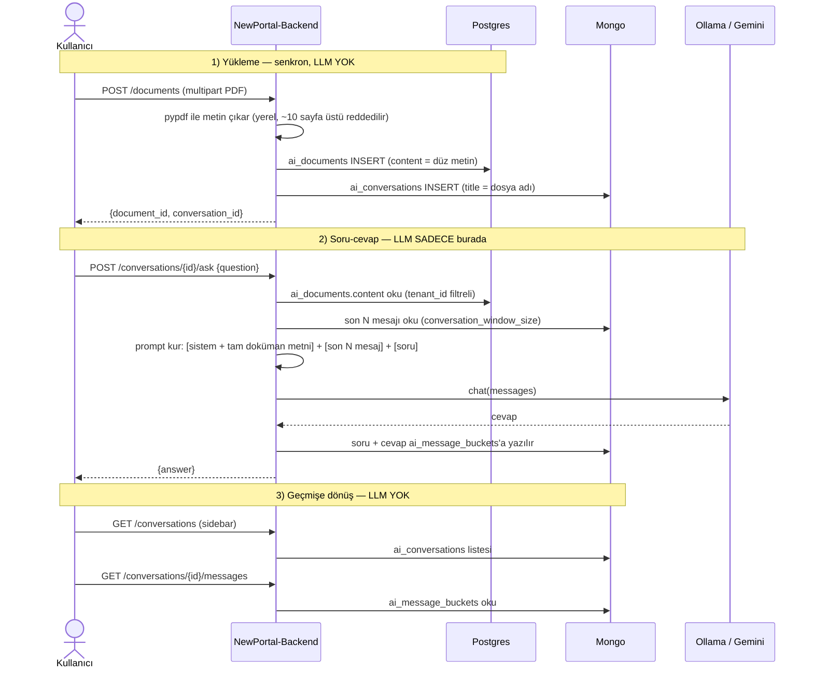

import CodeEditor from '@site/src/components/CodeEditor';
import CodeRail from '@site/src/components/CodeRail';

# PDF Doküman Analizi

:::info Implementasyon durumu — 2026-08-26 güncellendi
Bu özellik **kodlandı ve gerçek Postgres/Mongo/LLM'e karşı uçtan uca test edildi** (`models/ai_document.py`, `services/ai_chat_repository.py`, `services/document_chat_service.py`, `services/pdf_extraction_service.py`, `services/ollama_client.py`, `services/gemini_client.py`, `routers/documents.py`, migration `9ec1c91aaff2_ai_documents`). Bu sayfa önceki bir revizyonda RAG (pgvector + embedding + Bedrock) öneriyordu — o tasarım **tamamen terk edildi**, sebebi aşağıda.

**2026-08-26 güncellemesi:** `ask` endpoint'i artık generative UI kataloğuna (bkz. [NPFrontDocs — Generative UI Kataloğu](https://yusufkrnz.github.io/NPFrontDocs/architecture/generative-ui-catalog)) gerçekten bağlı — §11'deki "açık nokta" kapatıldı. Detaylar aşağıdaki "Çoklu Parça Görselleştirme — datasets" bölümünde.
:::

## Tanım

Kullanıcı kısa bir PDF yükler (MVP kapsamı: **≤10 sayfa** — sözleşme, rapor, hata kodu listesi gibi), doğal dille sorular sorar ("10201 hata kodu ne anlama geliyor?"), LLM sadece o dokümanın içeriğine dayanarak cevap verir. Sohbet, ChatGPT tarzı bir sidebar'da tutulur — her yüklenen PDF kendi "konu başlığı" olur, tıklanınca geçmiş sorular/cevaplar görünür.

## Neden RAG değil — geri alınan karar

Önceki tasarım pgvector + embedding + chunk'lama öneriyordu. Bu **yanlış** bir karardı, sebebi ölçekle ilgili bir varsayım hatasıydı: RAG, **büyük** dokümanlarda (onlarca sayfa) context'i küçük tutmak için var. MVP kapsamı 2-3 sayfa (≤10 sayfa sınırı `services/pdf_extraction_service.py::MAX_PAGE_COUNT` ile kodda uygulanıyor) — bu boyutta doküman zaten herhangi bir modelin context penceresine sığıyor, chunk'lama/embedding/vector arama **hiçbir sorunu çözmeden** karmaşıklık ekliyordu. Ölçtük: 6 sayfalık bir PDF'in tam metni (5523 token) tek prompt'ta sorunsuz işleniyor.

**10-20+ sayfa ihtiyacı netleşirse RAG geri gelir** — ama o zaman bile RAG'ın çözdüğü şey "context'i küçük tutmak", model/donanım hızını değil (bkz. aşağıdaki performans bölümü, bu ayrımı deneyle gösteriyor).

## Akış



LLM çağrısı **sadece adım 2'de**, sadece o isteğin ömrü boyunca gerçekleşir — upload, kayıt, sidebar listeleme, geçmiş okuma adımlarının hiçbiri LLM'e dokunmaz.

## Şema

Tek yeni Postgres tablosu — [Multi-tenancy](/guides/multi-tenancy)'deki shared-schema + `tenant_id` modeline uyar:

```
ai_documents
  id                uuid pk
  tenant_id         uuid, FK -> tenants.id (ON DELETE CASCADE)
  uploaded_by_id    uuid, FK -> users.id
  file_name         varchar(255)
  file_path         text          -- storage/documents/{tenant_id}/{id}.pdf, .gitignore'da
  content           text          -- pypdf çıktısı, düz metin — embedding/chunk YOK
  page_count        int
  status            varchar(20)   -- şu an hep "ready" (işleme senkron, saga yok)
  conversation_id   varchar(24), UNIQUE  -- Mongo ai_conversations._id, cross-DB referans

  index (tenant_id, uploaded_by_id)
```

Sohbet geçmişi burada değil — mevcut `ai_conversations`/`ai_message_buckets` (Mongo, Bucket Pattern) kullanılıyor, aynen [databaseschema](https://yusufkrnz.github.io/databaseschema/mongodb/ai-message-buckets)'daki tasarım. Yeni bir koleksiyon açılmadı, `services/ai_chat_repository.py` mevcut şemaya yazıp okuyor.

## Neden outbox/saga YOK

[Tenant Provisioning](/guides/tenant-provisioning-outbox) sayfasındaki outbox motoru mevcut ve çalışır durumda ama burada **kullanılmadı** — outbox, uzun/harici çağrı gerektiren işler için var (mail gönderimi gibi). PDF metin çıkarma (≤10 sayfa) yerel/CPU-bound bir işlem, ölçülen süresi milisaniyeler — senkron HTTP request'i bloklamıyor, outbox eklemek bu ölçekte gereksiz katman olurdu.

## Neden RLS YOK — bilinçli, geçici bir açık

`ai_documents.tenant_id` var ama **RLS policy'si yok** — proje genelinde hiçbir tabloda yok (`ENABLE ROW LEVEL SECURITY`/`CREATE POLICY` migration'larda sıfır sonuç veriyor). Tenant izolasyonu şu an tamamen **uygulama kodundaki** `WHERE tenant_id = ...` filtresine dayanıyor (bkz. `services/document_chat_service.py::ask_question`). `get_tenant_session()` zaten `app.current_tenant`'ı set ediyor (bkz. [Tenant Provisioning](/guides/tenant-provisioning-outbox#session-factory--coredbpy)) — merkezi bir RLS guard'ı yazılınca bu tablo da otomatik korunacak, uygulama kodu değişmeyecek. **Bu tüm proje genelinde bilinen bir açık, sadece bu feature'a özgü değil** — merkezi RLS guard'ı ayrı bir iş olarak planlandı.

## LLM Sağlayıcısı — Ollama (local) / Gemini (dev hız için)

`core/settings.py::llm_provider` (`"ollama"` | `"gemini"`) `services/document_chat_service.py::ask_question`'daki tek bir switch — geri kalan kod (upload, Postgres, Mongo, bucket, router) sağlayıcıdan tamamen habersiz, `services/ollama_client.py` ve `services/gemini_client.py` **aynı imzayı** (`chat(messages: list[dict]) -> str`) karşılıyor.

### Neden Bedrock değil — bu feature'a özgü, `/aws/bedrock` kararından farklı

[Bedrock](/aws/bedrock), AI katmanının (dinamik UI/tool-calling) genel LLM sağlayıcı kararı — ama bu karar **PDF/finansal doküman analizi için uygulanmadı**. Gerekçe farklı: burada yüklenen doküman gerçek, potansiyel hassas müşteri verisi (kâr/zarar tablosu gibi) — ve Bedrock üzerinden Claude/Titan çağırmak da veriyi Anthropic/Amazon'un eğittiği bir modele gönderiyor, sadece "AWS içinde" oluyor. **Veri egemenliği ilkesi burada AI katmanının genel kararından daha katı**: veri hiçbir 3. parti AI sağlayıcısının modeline gitmemeli.

Bu ilkeyle tutarlı tek seçenek **açık ağırlıklı (open-weight) bir modeli kendi kontrol edilen donanımda çalıştırmak** — `services/ollama_client.py` (local Ollama, `qwen14b`) tam olarak bunu yapıyor, veri hiç dışarı çıkmıyor.

### Gemini neden var — geçici, bilinçli bir MVP tavizi

Local geliştirme sırasında (bu Mac, Apple M4/24GB) `qwen14b` ölçülen üretim hızı **~3.6 token/saniye** — donanım sınırı, model seçimiyle tam çözülmüyor (aşağıya bkz.). Geliştirme makinesini yormamak ve akışı hızlı iterasyonla doğrulamak için `services/gemini_client.py` eklendi, `LLM_PROVIDER=gemini` ile `.env`'den açılıyor. **Bu, veri egemenliği ilkesinin bir istisnası, iptali değil** — gerçek üretim/canlı ortam kararı ayrı verilecek (muhtemelen: kendi hesabımızda kiralık bir GPU sunucusu + açık model, bkz. "Prod için açık nokta" altında).

`.env`:
```
LLM_PROVIDER=gemini
GEMINI_API_KEY=...
```

## Performans — gerçek ölçüm verisi

Bu bölüm tahmin değil, bu makinede ölçüldü (6 sayfalık gerçek bir PDF, Türkçe içerik, gerçek soru).

### qwen14b (local, Ollama) — donanım sınırlı

| Adım | Süre | Not |
|---|---|---|
| `think:false` olmadan | 110s | qwen14b qwen3 tabanlı bir **reasoning modeli** — cevaptan önce uzun bir iç muhakeme bloğu üretiyor, basit bir soruda bile |
| `think:false` ile | 8.4s | Aynı soru, thinking kapatılınca |
| Tam doküman + soru (`num_ctx` varsayılan 4096) | **400 Bad Request** | 5523 token'lık prompt, Ollama'nın varsayılan context penceresini (4096) aşıyor |
| Tam doküman + soru (`num_ctx=8192`, warm model) | ~19-23s | Kök neden çözüldü, ama üretim hızı (~3.6 tok/s) donanım sınırı — daha büyük dokümanda büyümez ama daha uzun cevapta orantılı büyür |

**Neden büyük context'te yavaşlık modelden bağımsız, temel bir mekanik:** Prefill (prompt işleme) GPU'da paralel, hızlı — 5523 token 0.6s'de işleniyor. Asıl yavaşlık **üretim** — her çıktı token'ı, tüm context'e (attention) bakarak üretiliyor, context büyüdükçe bu maliyet büyür. 10-20 sayfaya çıkılırsa hem prefill hem üretim yavaşlar VE `num_ctx`'in daha da büyütülmesi gerekir — bu noktada RAG (context'i küçük tutma) tekrar gündeme gelir.

`services/ollama_client.py`'de kalıcı düzeltmeler:
```python
"think": False,                                  # 110s -> 8.4s
"options": {"num_ctx": settings.ollama_num_ctx},  # 8192, 400 hatasını çözüyor
```

### Gemini — model denemeleri

| Model | Sonuç |
|---|---|
| `gemini-2.5-flash` | 404 — "no longer available to new users", API `gemini-3.6-flash` öneriyor |
| `gemini-3.6-flash` | Çalışıyor ama varsayılan thinking modunda (~450 thought-token, gereksiz), `thinkingConfig.thinkingBudget: 0` **400 Invalid Argument** döndü — bu modelde kapatılamıyor |
| `gemini-3.1-flash-lite` | ✅ Thinking yok, tam doküman + soru **~1.4s'de** tamamlandı — seçilen model |

`core/settings.py::gemini_model` default'u bu yüzden `gemini-3.1-flash-lite`.

### 3 saniye hedefi — gerçekçi durum

qwen14b ile bu donanımda **fiziksel olarak mümkün değil** (üretim hızı sabit ~3.6 tok/s, kısa bir cevap bile 10+ token). Gemini (`flash-lite`, thinking kapalı) ile ölçülen gerçek süre ~1.4s — hedefin altında, ama veri Google'a gidiyor (yukarıdaki tavizle aynı). Local + 3sn + veri hiç dışarı çıkmıyor üçlüsü **aynı anda** bu donanımda sağlanamıyor; biri feda ediliyor.

### Prod için açık nokta

Gerçek üretimde veri egemenliği ilkesi bozulmayacaksa, hız için tek tutarlı yol **kendi hesabımızda kiralanan bir GPU sunucusu** (AWS/RunPod/Hetzner, açık model orada çalışır) — kod tarafında `OLLAMA_BASE_URL`'i değiştirmekten fazlası gerekmiyor (`services/ollama_client.py` zaten `settings.ollama_base_url`'e istek atıyor). Bu, sabit maliyetli olduğu için (aylık kiralık sunucu, kullanılmasa da çalışır) trafiğin gerçek maliyeti karşıladığı noktaya kadar ertelendi — henüz karar verilmedi.

## Konuşma penceresi — maliyet kontrolü

`core/settings.py::conversation_window_size = 4` (son 2 soru-cevap çifti). [Konuşma Bağlamı ve Token Bütçesi](/ai/conversation-context)'ndeki pencereleme ilkesinin aynısı, ama gerekçe biraz farklı: buradaki asıl maliyet kaynağı **doküman metninin her istekte tekrar gönderilmesi** (kaçınılmaz, doküman sabit kaldığı sürece) — geçmiş penceresi küçük tutulursa en azından **konuşma uzadıkça katlanan** kısım engellenir. Başlangıçta 20 olarak tasarlanmıştı, maliyet endişesiyle 4'e düşürüldü; geçmişi tamamen kaldırmadık çünkü kullanıcı takip sorusu ("peki ya bir öncekinde?") sorarsa modelin en azından son alışverişi görmesi gerekiyor.

Trafiğin gerçek maliyeti gösterdiği noktada ele alınacak, henüz kurulmayan bir sonraki optimizasyon: **prompt caching** — doküman metnini (sistem promptunun büyük kısmı) sağlayıcı tarafında cache'leyip sonraki sorularda tekrar göndermemek. Şimdiden kurulmadı, erken optimizasyon.

## Çoklu Parça Görselleştirme — datasets

`ask` endpoint'i artık düz metnin yanında (opsiyonel) **yapılandırılmış veri** de döndürüyor —
[NPFrontDocs generative-ui-catalog.mdx](https://yusufkrnz.github.io/NPFrontDocs/architecture/generative-ui-catalog)'daki
whitelist katalog sistemine bağlanan taraf burası. §11'de "backend bunu hiç döndürmüyor" diye
işaretlenen açık nokta buydu — kapatıldı, gerçek Gemini çağrılarıyla uçtan uca test edildi.

### Sözleşme — `AskQuestionResponse`

```python
class AskQuestionResponse(BaseModel):
    answer: str
    datasets: list[Dataset] = []   # tekil "dataset" DEĞİL — liste
```

**Neden liste, neden tekil değil:** kullanıcı tek istekte birden fazla bağımsız şey isteyebiliyor
("churn'ü kart yap, satış hunisini ayrı grafik yap, destek trendini de göster"). Her `Dataset`
elemanı kendi başına bağımsız bir veri parçası — LLM'den istenen SADECE ham veriyi (fields+rows)
çıkarması. Şu ikisi kasıtlı olarak backend'in/LLM'in kararı DEĞİL:

- **Mark/chart tipi** — deterministik olarak frontend'deki `decideMarkFromDataShape`'e ait (zaten böyleydi, bkz. Şema bölümü).
- **Kompozisyon** — kaç parça geldiği, hangi sırada/nasıl bir arada gösterileceği de artık frontend'de (`datasetToNode.ts::buildNodeFromDatasets`) deterministik: tek satır + tek sayısal alan → büyük gösterge kartı (`StatComponent`), diğerleri → grafik, birden fazla parça varsa sabit `LayoutNode(direction:'col')` içinde alt alta. Bu, "LLM chart tipini icat etmiyor" ilkesinin kompozisyona genişletilmiş hali — aksi halde LLM her istekte farklı bir yerleşim icat edebilir, şemaya uysa bile öngörülemez bir deneyim doğar.

### Prompt — `DATASET_OUTPUT_INSTRUCTION`

LLM'e her istekte, dokümanla birlikte, JSON zarfının biçimi ve `datasets` şeması anlatılıyor
(bkz. `services/document_chat_service.py::DATASET_OUTPUT_INSTRUCTION`, `SYSTEM_PROMPT`'un
hemen ardına ekleniyor). Provider'ların JSON-mode'u da açık: Gemini `responseMimeType:
"application/json"`, Ollama `format: "json"` (`ollama_client.chat`/`gemini_client.chat`'e
eklenen `json_mode` parametresi) — sözdizimsel olarak geçerli JSON garanti ediyor, ama zarfın
TAM olarak beklenen şekilde olacağını garanti etmiyor, o yüzden parse tarafı savunmacı.

### Savunmacı parse — `_parse_llm_response`

Whitelist'le aynı ilke: parse ya da doğrulama başarısız olursa görselleştirmeden sessizce
vazgeçilir, kullanıcı her zaman bir cevap alır, hiçbir zaman hata fırlatılmaz.

- Markdown fence'leri (` ```json `, ` ```JSON `, dil etiketsiz) regex ile temizlenir.
- `answer` alanı gerçekten string değilse (LLM iç içe bir obje döndürmüşse) ham metne düşülür —
  `str(...)` ile Python repr'ine çevirip göstermek YOK (canlı testte yakalanan gerçek bir hataydı).
- `datasets` listesindeki her eleman **bağımsız** doğrulanır — bir eleman geçersizse sadece o
  atlanır, diğer geçerli parçalar korunur (tekil `Dataset` içindeki alanların birbirine bağımlı
  olmasından — `rowCount == len(rows)` — farklı bir durum, orada kısmi kurtarma yok).
- `Dataset.rows`'ta artık `min_length=1` yok, bunun yerine `rowCount == len(rows)` zorunlu
  (0 satırlı geçerli bir sonuç önceden yanlışlıkla reddediliyordu).
- `rows` içinde boolean değer reddediliyor (`mode="before"` field_validator) — Pydantic v2'nin
  `bool <: int` coercion'ı sessizce `True`/`False`'u `1`/`0`'a çevirip kataloğun 3'lü alan tipi
  setinde (categorical/numerical/temporal) olmayan bir tipi gizlice sızdırırdı.

### Canlı testte gözlemlenen gerçek sınırlar

`novacrm-q2-2026-raporu.pdf` ile gerçek Gemini çağrılarıyla test edildi, üç gerçek sınır tespit edildi:

| Durum | Gözlemlenen davranış | Neden |
|---|---|---|
| Satış hunisi (`Aşama` + `Fırsat Sayısı`) istendi | Bar grafiğe düştü, gerçek huni şekline değil | Kataloğun whitelist'inde funnel mark'ı yok — kontrollü genişleme ilkesiyle (bkz. NPFrontDocs §6) bilinçli, "yanlış" değil |
| "Açılan" + "kapanan" talep aynı grafikte istendi | Sadece "açılan" serisi geldi, "kapanan" sessizce kayboldu | `Dataset`/`ChartNode.encoding` tek `y` alanı taşıyor — çoklu seri (grouped/multi-line) desteklenmiyor, bu bir `ChartNode` şema genişletmesi gerektirir, henüz yapılmadı |
| Churn + MRR "büyük kart" istendi | Bazı denemelerde LLM ikisini TEK bir 2 satırlık `dataset`'e koydu → `datasetToNode.ts`'in "1 satır = kart" kuralı tetiklenmedi, ölçekleri uyuşmayan (3.815.000 vs 2,1) tek bir bar grafiğe düştü | LLM'in birden fazla tekil göstergeyi nasıl gruplayacağı garanti edilmiyor — prompt bunu açıkça yasaklamıyor |

Kompozisyon yerleşimi de (`direction:'col'`, hep dikey) sabit — kullanıcı "yan yana göster" dese
bile şu an karşılanamıyor, bilinçli bir kapsam sınırı (bkz. NPFrontDocs §7).

## Kod — orkestrasyon

<CodeRail>
  <CodeEditor
    filename="services/document_chat_service.py"
    code={`async def ask_question(session, *, tenant_id, conversation_id, question):
    # RLS yok — izolasyon burada app-level tenant_id filtresine dayanıyor
    document = await session.execute(
        select(AiDocument).where(
            AiDocument.conversation_id == conversation_id,
            AiDocument.tenant_id == tenant_id,
        )
    )
    document = document.scalar_one_or_none()
    if document is None:
        raise NotFoundError("Doküman bulunamadı", code="document.not_found")

    history = await ai_chat_repository.get_recent_messages(
        conversation_id=conversation_id, limit=settings.conversation_window_size
    )
    system_content = f"{SYSTEM_PROMPT}\\n\\n{DATASET_OUTPUT_INSTRUCTION}\\n\\n--- DOKÜMAN ---\\n{document.content}"
    messages = [{"role": "system", "content": system_content}]
    for m in history:
        messages.append({"role": "assistant" if m["sender_type"] == "assistant" else "user", "content": m["content"]})
    messages.append({"role": "user", "content": question})

    await ai_chat_repository.append_message(conversation_id=conversation_id, tenant_id=tenant_id, sender_type="user", content=question)
    chat_fn = gemini_client.chat if settings.llm_provider == "gemini" else ollama_client.chat
    raw = await chat_fn(messages, json_mode=True)
    answer, datasets = _parse_llm_response(raw)  # savunmacı parse — yukarıya bkz.
    # Geçmişe (ve bir sonraki isteğin bağlamına) sadece doğal dil cevap yazılır, ham JSON
    # zarfı değil — aksi halde LLM kendi zarf biçimini "örnek" olarak geri görür.
    await ai_chat_repository.append_message(conversation_id=conversation_id, tenant_id=tenant_id, sender_type="assistant", content=answer)
    return answer, datasets`}
  />
</CodeRail>

## Kapsam dışı (bilinçli sınır)

- **>10 sayfa** — `MAX_PAGE_COUNT` ile kodda reddediliyor. Aşılırsa RAG (chunk + embedding + vector arama) gerekir, bu sayfanın önceki revizyonunda tasarlanmıştı, gerektiğinde geri getirilir.
- **Taranmış (görsel) PDF / OCR** — metin katmanı olmayan PDF `document.no_text_layer` hatası döner.
- **Prompt caching** — maliyet gerçek trafikte netleşince değerlendirilecek.
- **Prod LLM sağlayıcı kararı** — Gemini sadece local/dev tavizi, kalıcı değil.
- **Merkezi RLS guard** — proje genelinde açık, ayrı bir iş.
- **Çoklu seri grafik (grouped/multi-line)** — `ChartNode.encoding` tek `y` alanı taşıyor, gerçek testte kayıt edilen bir sınır (bkz. yukarı).
- **Funnel mark'ı** — kataloğun whitelist'inde yok, bar'a düşüyor (bilinçli).
- **Kompozisyon yerleşimi (yan yana vs alt alta)** — şu an sabit `LayoutNode(direction:'col')`, kullanıcı isteğine göre değişmiyor.
- **LLM'in tekil göstergeleri ayrı `dataset`'lere bölmesi garanti değil** — prompt bunu açıkça zorlamıyor, bazen tek tabloya toplanabiliyor (bkz. yukarıdaki tablo, churn+MRR örneği).
- **Backend'de yapılandırılmış logging** — `ask_question`'ın ham LLM cevabını/parse sonucunu kalıcı olarak loglayan bir mekanizma yok, teşhis geçici `logger.warning` ile yapıldı ve commit'ten önce kaldırıldı.

## İlgili sayfalar

- [Multi-tenancy](/guides/multi-tenancy) — shared-schema + tenant_id kararı
- [Tenant Provisioning — Outbox Pattern](/guides/tenant-provisioning-outbox) — bu feature'ın KULLANMADIĞI ama var olan motor
- [AWS › Bedrock](/aws/bedrock) — AI katmanının genel LLM kararı, bu sayfanın neden ondan ayrıştığı
- [Konuşma Bağlamı ve Token Bütçesi](/ai/conversation-context) — pencereleme ilkesinin kökeni
- [NPFrontDocs — Generative UI Kataloğu](https://yusufkrnz.github.io/NPFrontDocs/architecture/generative-ui-catalog) — `datasets`'in tüketici tarafı: whitelist mark seçimi, kompozisyon, render katmanı
