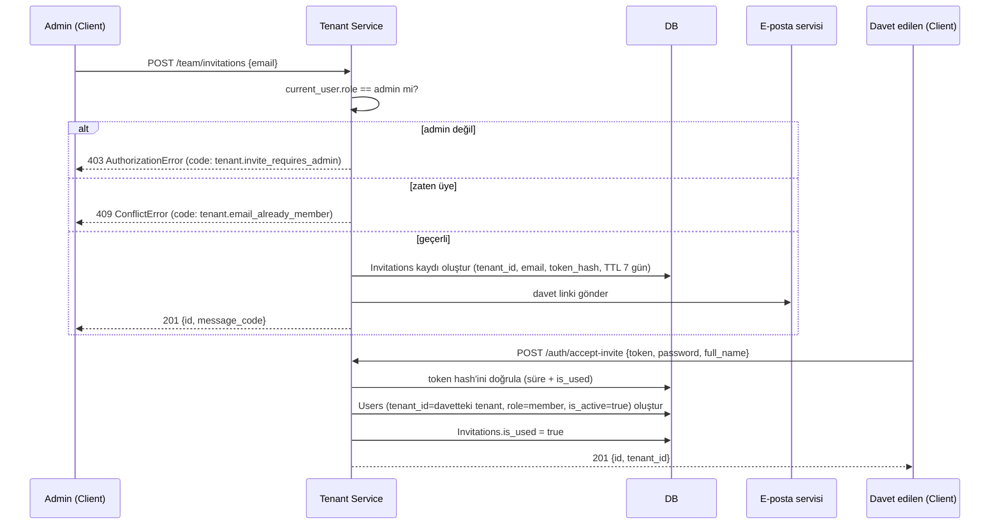

import ApiExample from '@site/src/components/ApiExample';
import CodeRail from '@site/src/components/CodeRail';

<CodeRail>
  <ApiExample
    method="POST"
    path="/team/invitations"
    requestHeaders={{ Authorization: 'Bearer <admin_access_token>' }}
    request={{ email: 'mehmet@akguntic.com' }}
    response={{ id: 'inv_7a21c9', message_code: 'tenant.invitation.sent' }}
  />
</CodeRail>

# Ekip Daveti

[Kayıt olma](/use-cases/user-registration) sadece **ilk** kullanıcıyı (tenant admin'i) oluşturur. Sonraki her üye bu davet akışıyla eklenir — açık, self-servis bir "register" ile rastgele bir tenant'a katılmak mümkün değildir.

## Akış

## Neden davet kabulünde ayrıca e-posta doğrulama yok

[Kayıt olma](/use-cases/user-registration)'da hesap `is_active=false` ile başlar çünkü e-posta sahipliği doğrulanmamıştır. Davet akışında bu adım gereksiz — davet zaten o e-posta adresine gönderildi, linke tıklayıp token'ı sunabilmek e-postanın sahipliğini kanıtlar. Bu yüzden davetle katılan kullanıcı doğrudan `is_active=true` olarak oluşturulur.

## Hata / edge-case senaryoları

| Senaryo | Sonuç |
|---|---|
| Davet gönderen admin değil | `403 AuthorizationError`, `code: tenant.invite_requires_admin` |
| Davet edilen e-posta zaten bu tenant'ta üye | `409 ConflictError`, `code: tenant.email_already_member` |
| Davet edilen e-posta **başka bir tenant'ta** zaten kayıtlı | `409 ConflictError`, `code: auth.email_already_registered` — e-posta genel olarak tekildir (bkz. [Kayıt olma](/use-cases/user-registration)) |
| Davet token'ı süresi dolmuş (7 günden eski) | `401 AuthenticationError`, `code: tenant.invitation_expired` — admin yeniden davet göndermeli |
| Davet token'ı zaten kullanılmış | `401 AuthenticationError`, `code: tenant.invitation_already_used` |

## Sırada ne var

Davetle katılan kullanıcı doğrudan [Login ve token oluşturma](/use-cases/login-and-token-issuance) akışıyla giriş yapabilir — ayrıca bir aktivasyon adımı yoktur.
