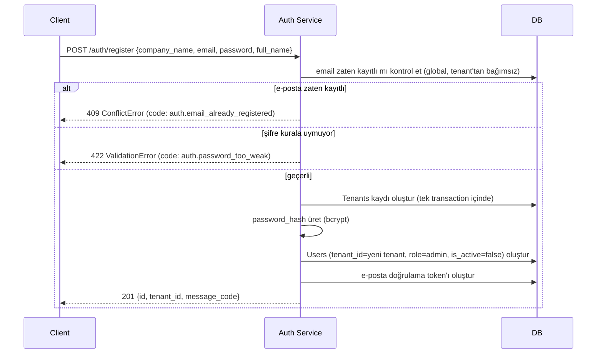

import ApiExample from '@site/src/components/ApiExample';
import CodeRail from '@site/src/components/CodeRail';

<CodeRail>
  <ApiExample
    method="POST"
    path="/auth/register"
    request={{
      company_name: 'Akgün Ticaret',
      email: 'ayse@akguntic.com',
      password: '••••••••',
      full_name: 'Ayşe Yılmaz',
    }}
    response={{ id: 'usr_8f2a1c', tenant_id: 'tn_3d9f21', message_code: 'auth.register.verification_sent' }}
  />
</CodeRail>

# Kayıt olma

Bu endpoint **bireysel** kayıt değildir — çağrıldığında hem yeni bir **tenant** (şirket) hem de o tenant'ın ilk kullanıcısı **admin rolüyle** birlikte oluşturulur. NewPortal bir B2B SaaS olduğu için sisteme "boşluğa" kayıt olan tek bir kullanıcı yoktur; her kullanıcı bir tenant'a bağlıdır — ya burada yeni bir tenant açarak (ilk kişi), ya da [Ekip Daveti](/use-cases/team-invitation) ile var olan bir tenant'a katılarak.

Yeni hesap `is_active = false` ile oluşturulur — e-posta doğrulanana kadar login engellenir (bkz. [E-posta Doğrulama](/services/auth-service/email-verification)). Yanıt gerçek bir "hoş geldin" metni değil, i18n `message_code`'u döner (bkz. [coding-standards](/guides/coding-standards)).

## Akış

Tenant ve ilk kullanıcı **tek bir DB transaction'ında** oluşturulur — biri başarılı diğeri başarısız olup yarım kalmış bir tenant (kullanıcısız şirket kaydı) asla ortada kalmaz.

## Şifre kuralı

- En az 8 karakter, en az bir harf ve bir rakam
- Kasıtlı olarak agresif bir karmaşıklık kuralı (özel karakter zorunluluğu vb.) **yok** — kayıt sürtünmesini artırmadan yeterli gücü sağlamak amaçlanıyor; gerçek güvenlik yükü zaten [bcrypt](/guides/libraries)'in kendisinde
- Kural ihlali `ValidationError` (422) olarak, `code: "auth.password_too_weak"` ile döner — hangi kuralın ihlal edildiği `params` içinde belirtilir (ör. `{"min_length": 8}`)

## Hata / edge-case senaryoları

| Senaryo | Sonuç |
|---|---|
| E-posta zaten kayıtlı | `409 ConflictError`, `code: auth.email_already_registered` — e-posta tüm tenant'lar genelinde tekildir, aynı e-posta iki farklı tenant'ta kullanıcı olamaz |
| Şifre kurala uymuyor | `422 ValidationError`, `code: auth.password_too_weak` |
| `email` formatı geçersiz | `422` — Pydantic şema seviyesinde reddedilir, servise hiç ulaşmaz (bkz. [Merkezi Hata Yönetimi](/guides/error-handling)) |
| `company_name` boş | `422 ValidationError` — tenant'sız kullanıcı oluşturulamaz |

## Sırada ne var

Kayıt başarılı olduktan sonra kullanıcı henüz giriş yapamaz — e-posta doğrulaması gerekir (bkz. [E-posta Doğrulama](/services/auth-service/email-verification)), sonra [Login ve token oluşturma](/use-cases/login-and-token-issuance) akışı devreye girer. Admin, giriş yaptıktan sonra ekip arkadaşlarını [Ekip Daveti](/use-cases/team-invitation) ile aynı tenant'a ekleyebilir.
