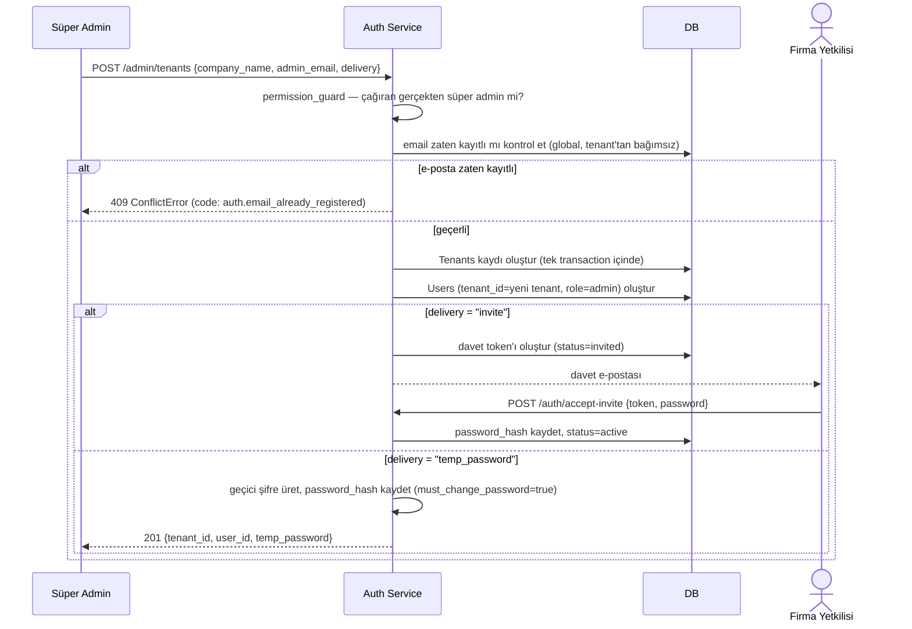

import ApiExample from '@site/src/components/ApiExample';
import CodeRail from '@site/src/components/CodeRail';

<CodeRail>
  <ApiExample
    method="POST"
    path="/admin/tenants"
    requestHeaders={{ Authorization: 'Bearer <süper-admin-token>' }}
    request={{
      company_name: 'Akgün Ticaret',
      admin_email: 'ayse@akguntic.com',
      delivery: 'invite',
    }}
    response={{ tenant_id: 'tn_3d9f21', user_id: 'usr_8f2a1c', message_code: 'admin.tenant.invite_sent' }}
  />
</CodeRail>

# Tenant Oluşturma (Süper Admin)

:::info Karar değişikliği
Bu akış daha önce **self-servis kayıt** (`POST /auth/register`, kullanıcı kendi formunu dolduruyordu) olarak tasarlanmıştı. Gerçek iş modeli farklı çıktı: satış görüşmesi sonrası **süper admin (platform ekibi)** tenant'ı ve ilk admin kullanıcısını oluşturuyor — firma kendi kaydını açmıyor. Bkz. [Multi-tenancy](/guides/multi-tenancy) için izolasyon etkisi.
:::

Bu endpoint **genel kullanıma açık değil** — sadece platform'un kendi `is_super_admin` yetkisine sahip kullanıcıları çağırabilir (bkz. [Guard Mimarisi](/guards) — `permission_guard`). Çağrıldığında hem yeni bir **tenant** (şirket) hem de o tenant'ın ilk kullanıcısı **admin rolüyle** birlikte oluşturulur. NewPortal bir B2B SaaS olduğu için sisteme "boşluğa" kayıt olan tek bir kullanıcı yoktur; her kullanıcı bir tenant'a bağlıdır — ya süper admin burada yeni bir tenant açar (ilk kişi), ya da [Ekip Daveti](/use-cases/team-invitation) ile var olan bir tenant'a katılır.

## İki teslimat şekli

`delivery` alanı, firma yetkilisinin ilk erişimi nasıl alacağını belirler — süper admin duruma göre (e-posta mı ulaşır, telefonda mı iletiliyor) seçer:

| `delivery` | Ne olur | Firma yetkilisi ne yapar |
|---|---|---|
| `"invite"` (varsayılan) | [Ekip Daveti](/use-cases/team-invitation)'ndeki **aynı** davet mekanizması tetiklenir | E-postadaki linke tıklar, `POST /auth/accept-invite {token, password}` ile kendi şifresini belirler |
| `"temp_password"` | Response'ta geçici bir şifre döner | Süper admin bunu telefon/yüz yüze iletir; ilk `POST /auth/login`'de `must_change_password: true` döner, `POST /auth/change-password` zorunlu |

İki modda da **aynı** `Users` kaydı (`role=admin`) oluşuyor — fark sadece "ilk şifre nereden geliyor". İlk çalışanı davet eden mekanizma ile ilk admin'i oluşturan mekanizma bu sayede **tek kod yolunu** paylaşıyor, ayrı bir "register" akışı bakımda tutulmuyor.

## Akış

Tenant ve ilk kullanıcı **tek bir DB transaction'ında** oluşturulur — biri başarılı diğeri başarısız olup yarım kalmış bir tenant (kullanıcısız şirket kaydı) asla ortada kalmaz.

## Hata / edge-case senaryoları

| Senaryo | Sonuç |
|---|---|
| Çağıran süper admin değil | `403 AuthorizationError`, `code: auth.super_admin_required` |
| E-posta zaten kayıtlı | `409 ConflictError`, `code: auth.email_already_registered` — e-posta tüm tenant'lar genelinde tekildir |
| `company_name` boş | `422 ValidationError` — tenant'sız kullanıcı oluşturulamaz |
| `delivery = "temp_password"` ama admin şifreyi hiç değiştirmeden uzun süre kullanıyor | Henüz ele alınmadı — bkz. [Edge Case'ler](/edge-cases) adayı: geçici şifre için zorunlu son kullanma süresi |

## Sırada ne var

Firma yetkilisi giriş yaptıktan sonra (bkz. [Login ve token oluşturma](/use-cases/login-and-token-issuance)) ekip arkadaşlarını [Ekip Daveti](/use-cases/team-invitation) ile aynı tenant'a ekleyebilir — bu noktadan sonra süper admin sürece hiç girmez. Süper admin tarafının kendi paneli (tenant listesi, plan/kullanım takibi, provisioning geçmişi) ayrı bir konu — henüz dokümante edilmedi, ihtiyaç netleşince ayrı bir bölüm olarak eklenecek.
